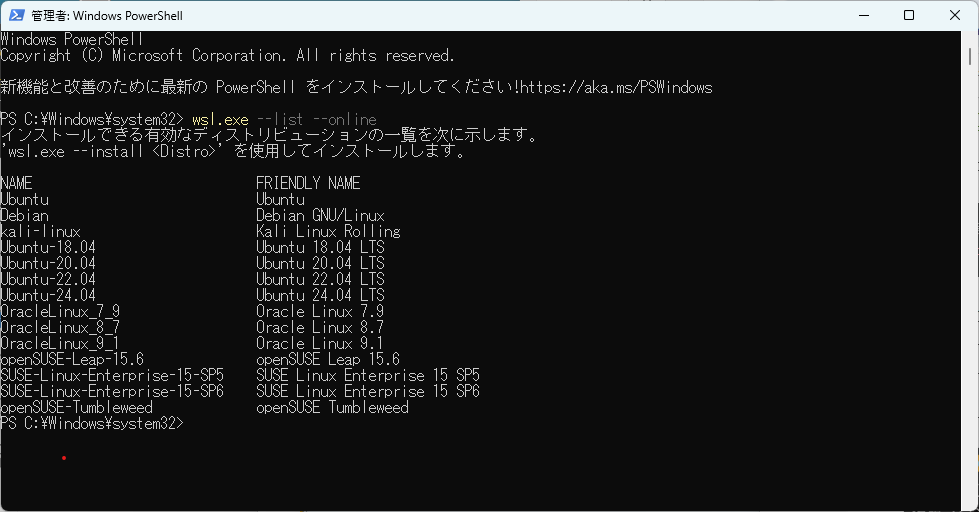
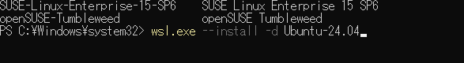
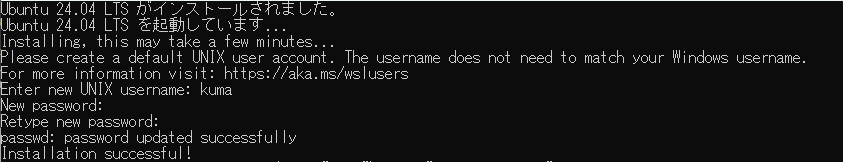

# 環境整備

* wsl で Ubuntu-24.04 を入れて、
* gcc-12 以下、必要なパッケージをインストールする。
* https://github.com/tendai22/mame-sbc を clone して、
* make コマンドを実行する。

mame-sbc を使えるようにするまでの手順を一言でいえば、これだけなのだが、ちょっと味気なさすぎるので、もう少し詳しく手順を説明する。WSL のインストールや、Linux 環境に不慣れな人も、下記を参考にしてトライしてみてほしい。

## 1. Linux/WSLのインストール

> Windows PC で Linux上のソフトを動かそうとする場合、WSL(Windows Subsystem for Linux) を使うのがよいと思う。私の趣味で、開発環境は Unix/Linux がよろしいので、ここでは WSL を使うやり方を説明する。

### 1.1. PowerShell を管理者モードで起動する。

* Windowsの「検索」窓で "PowerShell" と叩く。
* 上部検索結果に「Windows PowerShell」四角が出てくるので、カーソルをそこに置いて右クリックする。
* 4つ候補の筆頭が「管理者として実行」なので、それを選択する。


* なんか聞かれると思いますが、「はい」と答える。  
   PowerShell 窓が開く。

2. wsl.exe コマンドで選択候補を確認する。

```
> wsl.exe --list --online
```

と叩くと、Linux の種類一覧が出てくる。



3. wsl.exe で "Ubuntu-24.04" をインストールする。

mame のビルドには GCC (C/C++コンパイラ) Version 12 以上が必要です。GCC Version 12 をコマンド叩いてインストールするには、Ubuntu-24.04 か、それより新しい Linux が欲しい。



```
> wsl.exe --install -d Ubuntu-24.04
```

-d オプションで"Ubuntu-24.04" を指定してコマンドを開始する。数分かかるが、最終的にはインストールが終わり、唐突にユーザ名を聞かれる。



```
Enter New Unix Username: 
```

ここで、Linux で使用する「ユーザ名」を入力する。数文字で日頃使い慣れたアルファベット文字で自分の名前を決めて入力するとよい。私は昔から(事情が許せば)"kuma" という文字列を使用している。WSL 内部で使用するだけなので、Windows のログオン名と別でも構わない。

次に「パスワード」を入力する。自分が選んだ「ユーザ名」で Linux にログインするときに使用する由緒正しいパスワードである。今回は、sudo コマンドをなんども使いまくるが、このときに都度打ち込むことになるので、長すぎる文字列・覚えきれない文字列はやめておいたほうがよい。

```
New password:
```

パスワードを入力すると、再度同じパスワードの入力を求められる。打ち間違いなどで意図せぬ文字列で登録されることを防ぐのだ。

```
Retype new password:
```

再度のパスワード入力が成功し、パスワードが登録されると、

```
passwd: password updated successfully
```

と登録成功メッセージが返ってくる。入力間違いすると、再度 `New password: ` が返ってくるので、今度こそ間違えないように2度同じ文字列を入力して先に進んでほしい。

ログインする

```
To run a command as administrator (user "root"), use "sudo <command>".
See "man sudo_root" for details.

Welcome to Ubuntu 24.04.1 LTS (GNU/Linux 5.15.167.4-microsoft-standard-WSL2 x86_64)

 * Documentation:  https://help.ubuntu.com
 * Management:     https://landscape.canonical.com
 * Support:        https://ubuntu.com/pro

 System information as of Sat Nov 30 22:27:02 JST 2024

  System load:  0.55                Processes:             30
  Usage of /:   0.1% of 1006.85GB   Users logged in:       0
  Memory usage: 7%                  IPv4 address for eth0: 172.25.193.135
  Swap usage:   0%


This message is shown once a day. To disable it please create the
/home/kuma/.hushlogin file.
kuma@LAURELEY:~$ 
```

### 必要なパッケージをインストールする

mame 本家のドキュメント、"Compiling MAME"(https://docs.mamedev.org/initialsetup/compilingmame.html)を見て確認しておく。

"All Platform" の項に、

> To compile MAME, you need a C++17 compiler and runtime library. We support building with GCC version 10.3 or later and clang version 11 or later. MAME should run with GNU libstdc++ version 10.3 or later or libc++ version 11 or later. The initial release of any major version of GCC should be avoided. For example, if you want to compile MAME with GCC 12, you should use version 12.1 or later.

* C++言語: C++17 以降のバージョンが必要。GCC 使うなら GCC 10.3 以降
* ライブラリ: libstdc++ 10.3, libc++ 11 以後
* GCCメジャーバージョン最初のリリースは避けろ、GCC 12 なら、12.0 使わずに 12.1 以後で。

"Debian and Ubuntu (including Raspberry Pi and ODROID devices)" の項に、

```
sudo apt-get install git build-essential python3 libsdl2-dev libsdl2-ttf-dev libfontconfig-dev libpulse-dev qtbase5-dev qtbase5-dev-tools qtchooser qt5-qmake
```

とあります。これは `apt-get install`コマンドでインストールするためのコマンド列なので、`git ...` 以下のパッケージをインストールすることになります。`gcc`, `GUN make` 入っていないけど大丈夫なのかな?

WSLインストール直後の状態で、

```
kuma@LAURELEY:~$ gcc --version
Command 'gcc' not found, but can be installed with:
sudo apt install gcc
kuma@LAURELEY:~$ cc --version
Command 'cc' not found, but can be installed with:
sudo apt install gcc
kuma@LAURELEY:~$ make --version
Command 'make' not found, but can be installed with:
sudo apt install make        # version 4.3-4.1build1, or
sudo apt install make-guile  # version 4.3-4.1build1
kuma@LAURELEY:~$ 
```

gcc も GNU make も入っていませんね。必要なのは明らかなので、まず、gcc をインストールする。バージョンがだめなら GCC をビルドしなくてはならない。


```
kuma@LAURELEY:~$ sudo apt-get install gcc
[sudo] password for kuma:
```

```
Reading package lists... Done
Building dependency tree... Done
Reading state information... Done
The following additional packages will be installed:
  cpp cpp-13 cpp-13-x86-64-linux-gnu cpp-x86-64-linux-gnu gcc-13 gcc-13-base gcc-13-x86-64-linux-gnu
  gcc-x86-64-linux-gnu libaom3 libasan8 libatomic1 libc-dev-bin libc-devtools libc6-dev libcc1-0 libcrypt-dev
  libde265-0 libgcc-13-dev libgd3 libgomp1 libheif-plugin-aomdec libheif-plugin-aomenc libheif-plugin-libde265
  libheif1 libhwasan0 libisl23 libitm1 liblsan0 libmpc3 libquadmath0 libtsan2 libubsan1 libxpm4 linux-libc-dev
  manpages-dev rpcsvc-proto
Suggested packages:
  cpp-doc gcc-13-locales cpp-13-doc gcc-multilib make autoconf automake libtool flex bison gdb gcc-doc gcc-13-multilib
  gcc-13-doc gdb-x86-64-linux-gnu glibc-doc libgd-tools libheif-plugin-x265 libheif-plugin-ffmpegdec
  libheif-plugin-jpegdec libheif-plugin-jpegenc libheif-plugin-j2kdec libheif-plugin-j2kenc libheif-plugin-rav1e
  libheif-plugin-svtenc
The following NEW packages will be installed:
  cpp cpp-13 cpp-13-x86-64-linux-gnu cpp-x86-64-linux-gnu gcc gcc-13 gcc-13-base gcc-13-x86-64-linux-gnu
  gcc-x86-64-linux-gnu libaom3 libasan8 libatomic1 libc-dev-bin libc-devtools libc6-dev libcc1-0 libcrypt-dev
  libde265-0 libgcc-13-dev libgd3 libgomp1 libheif-plugin-aomdec libheif-plugin-aomenc libheif-plugin-libde265
  libheif1 libhwasan0 libisl23 libitm1 liblsan0 libmpc3 libquadmath0 libtsan2 libubsan1 libxpm4 linux-libc-dev
  manpages-dev rpcsvc-proto
0 upgraded, 37 newly installed, 0 to remove and 31 not upgraded.
Need to get 56.1 MB of archives.
After this operation, 196 MB of additional disk space will be used.
Do you want to continue? [Y/n] 
```


