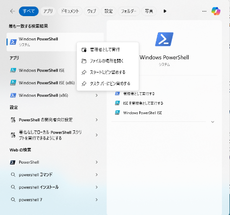

# 環境整備

* wsl で Ubuntu-24.04 を入れて、
* gcc-12 以下、必要なパッケージをインストールする。
* https://github.com/tendai22/mame-sbc を clone して、
* make コマンドを実行する。

mame-sbc を使えるようにするまでの手順を一言でいえば、これだけなのだが、ちょっと味気なさすぎるので、もう少し詳しく手順を説明する。WSL のインストールや、Linux 環境に不慣れな人も、下記を参考にしてトライしてみてほしい。

## 1. Linux/WSLのインストール

> Windows PC で Linux上のソフトを動かそうとする場合、WSL(Windows Subsystem for Linux) を使うのがよいと思う。私の趣味で、開発環境は Unix/Linux がよろしいので、ここでは WSL を使うやり方を説明する。

### 1.1. PowerShell を管理者モードで起動する。

* Windowsの「検索」窓で "PowerShell" と叩く。
* 上部検索結果に「Windows PowerShell」四角が出てくるので、カーソルをそこに置いて右クリックする。
* 4つ候補の筆頭が「管理者として実行」なので、それを選択する。



* なんか聞かれると思いますが、「はい」と答える。  
   PowerShell 窓が開く。

2. wsl.exe コマンドで選択候補を確認する。

```
> wsl.exe --list --online
```

と叩くと、Linux の種類一覧が出てくる。


3. wsl.exe で "Ubuntu-24.04" をインストールする。

mame のビルドには GCC (C/C++コンパイラ) Version 12 以上が必要です。GCC Version 12 をコマンド叩いてインストールするには、Ubuntu-24.04 か、それより新しい Linux が欲しい。


```
> wsl.exe --install -d Ubuntu-24.04
```

-d オプションで"Ubuntu-24.04" を指定してコマンドを開始する。数分かかるが、最終的にはインストールが終わり、唐突にユーザ名を聞かれる。


```
Enter New Unix Username: 
```

ここで、Linux で使用する「ユーザ名」を入力する。数文字で日頃使い慣れたアルファベット文字で自分の名前を決めて入力するとよい。私は昔から(事情が許せば)"kuma" という文字列を使用している。WSL 内部で使用するだけなので、Windows のログオン名と別でも構わない。

次に「パスワード」を入力する。自分が選んだ「ユーザ名」で Linux にログインするときに使用する由緒正しいパスワードである。今回は、sudo コマンドをなんども使いまくるが、このときに都度打ち込むことになるので、長すぎる文字列・覚えきれない文字列はやめておいたほうがよい。

```
New password:
```

パスワードを入力すると、再度同じパスワードの入力を求められる。打ち間違いなどで意図せぬ文字列で登録されることを防ぐのだ。

```
Retype new password:
```

再度のパスワード入力が成功し、パスワードが登録されると、

```
passwd: password updated successfully
```

と登録成功メッセージが返ってくる。入力間違いすると、再度 `New password: ` が返ってくるので、今度こそ間違えないように2度同じ文字列を入力して先に進んでほしい。

ログインする

```
To run a command as administrator (user "root"), use "sudo <command>".
See "man sudo_root" for details.

Welcome to Ubuntu 24.04.1 LTS (GNU/Linux 5.15.167.4-microsoft-standard-WSL2 x86_64)

 * Documentation:  https://help.ubuntu.com
 * Management:     https://landscape.canonical.com
 * Support:        https://ubuntu.com/pro

 System information as of Sat Nov 30 22:27:02 JST 2024

  System load:  0.55                Processes:             30
  Usage of /:   0.1% of 1006.85GB   Users logged in:       0
  Memory usage: 7%                  IPv4 address for eth0: 172.25.193.135
  Swap usage:   0%


This message is shown once a day. To disable it please create the
/home/kuma/.hushlogin file.
kuma@LAURELEY:~$ 
```

## 2. 必要なパッケージをインストールする

### 2.1. mame サイトを確認する。

mame 本家のドキュメント、"Compiling MAME"(https://docs.mamedev.org/initialsetup/compilingmame.html)を見て確認しておく。

"All Platform" の項に、

> To compile MAME, you need a C++17 compiler and runtime library. We support building with GCC version 10.3 or later and clang version 11 or later. MAME should run with GNU libstdc++ version 10.3 or later or libc++ version 11 or later. The initial release of any major version of GCC should be avoided. For example, if you want to compile MAME with GCC 12, you should use version 12.1 or later.

* C++言語: C++17 以降のバージョンが必要。GCC 使うなら GCC 10.3 以降
* ライブラリ: libstdc++ 10.3, libc++ 11 以後
* GCCメジャーバージョン最初のリリースは避けろ、GCC 12 なら、12.0 使わずに 12.1 以後で。

"Debian and Ubuntu (including Raspberry Pi and ODROID devices)" の項に、

```
sudo apt-get install git build-essential python3 libsdl2-dev libsdl2-ttf-dev libfontconfig-dev libpulse-dev qtbase5-dev qtbase5-dev-tools qtchooser qt5-qmake
```

とあります。これは `apt-get install`コマンドでインストールするためのコマンド列なので、`git ...` 以下のパッケージをインストールすることになります。`gcc`, `GUN make` 入っていないけど大丈夫なのかな?

### 2.2. gcc, GNU make のインストール

WSLインストール直後の状態で、

```
kuma@LAURELEY:~$ gcc --version
Command 'gcc' not found, but can be installed with:
sudo apt install gcc
kuma@LAURELEY:~$ cc --version
Command 'cc' not found, but can be installed with:
sudo apt install gcc
kuma@LAURELEY:~$ make --version
Command 'make' not found, but can be installed with:
sudo apt install make        # version 4.3-4.1build1, or
sudo apt install make-guile  # version 4.3-4.1build1
kuma@LAURELEY:~$ 
```

gcc も GNU make も入っていませんね。

まず、gcc をインストールする。インストールしてバージョンを確認する。`sudo apt-get install`コマンドを使う。

```
kuma@LAURELEY:~$ sudo apt-get install gcc
[sudo] password for kuma:
```

パスワードを聞いてくるので、さきほどの(WSL をインストールした際に設定した)パスワードを入力する。

```
Reading package lists... Done
Building dependency tree... Done
Reading state information... Done
The following additional packages will be installed:
  cpp cpp-13 cpp-13-x86-64-linux-gnu cpp-x86-64-linux-gnu gcc-13 gcc-13-base gcc-13-x86-64-linux-gnu
  gcc-x86-64-linux-gnu libaom3 libasan8 libatomic1 libc-dev-bin libc-devtools libc6-dev libcc1-0 libcrypt-dev
  libde265-0 libgcc-13-dev libgd3 libgomp1 libheif-plugin-aomdec libheif-plugin-aomenc libheif-plugin-libde265
  libheif1 libhwasan0 libisl23 libitm1 liblsan0 libmpc3 libquadmath0 libtsan2 libubsan1 libxpm4 linux-libc-dev
  manpages-dev rpcsvc-proto
Suggested packages:
  cpp-doc gcc-13-locales cpp-13-doc gcc-multilib make autoconf automake libtool flex bison gdb gcc-doc gcc-13-multilib
  gcc-13-doc gdb-x86-64-linux-gnu glibc-doc libgd-tools libheif-plugin-x265 libheif-plugin-ffmpegdec
  libheif-plugin-jpegdec libheif-plugin-jpegenc libheif-plugin-j2kdec libheif-plugin-j2kenc libheif-plugin-rav1e
  libheif-plugin-svtenc
The following NEW packages will be installed:
  cpp cpp-13 cpp-13-x86-64-linux-gnu cpp-x86-64-linux-gnu gcc gcc-13 gcc-13-base gcc-13-x86-64-linux-gnu
  gcc-x86-64-linux-gnu libaom3 libasan8 libatomic1 libc-dev-bin libc-devtools libc6-dev libcc1-0 libcrypt-dev
  libde265-0 libgcc-13-dev libgd3 libgomp1 libheif-plugin-aomdec libheif-plugin-aomenc libheif-plugin-libde265
  libheif1 libhwasan0 libisl23 libitm1 liblsan0 libmpc3 libquadmath0 libtsan2 libubsan1 libxpm4 linux-libc-dev
  manpages-dev rpcsvc-proto
0 upgraded, 37 newly installed, 0 to remove and 31 not upgraded.
Need to get 56.1 MB of archives.
After this operation, 196 MB of additional disk space will be used.
Do you want to continue? [Y/n] 
```

ぐちゃぐちゃ言って止まっているが、`Do you want to continue? [Y/n]` と、継続するかどうかを聞かれている。ためらわず"Y"を入力する。

バージョンを確認する。`gcc --version` とマイナス2個オプションをたたく。

```
kuma@LAURELEY:~$ gcc --version
gcc (Ubuntu 13.2.0-23ubuntu4) 13.2.0
Copyright (C) 2023 Free Software Foundation, Inc.
This is free software; see the source for copying conditions.  There is NO
warranty; not even for MERCHANTABILITY or FITNESS FOR A PARTICULAR PURPOSE.

kuma@LAURELEY:~$
```

バージョンは 13.2.0、これなら大丈夫ですね。

GNU make をインストールする。Ubuntu の場合、何もいわず make をインストールすると GNU make が入る。

`sudo apt-get install make` でよい。

```
kuma@LAURELEY:~$ sudo apt-get install make
```

こんどは `Do you want to continue?`と聞かれない。インストールサイズが小さくストレージあふれの危険が少ないときは確認せずに勝手に進めてしまうのだと思っている。

いちおうバージョンも確認しておこうか。GNU make は進化速度がそれほどでもなく、最新版にこだわらなくても大丈夫だと思っているのだが。

```
kuma@LAURELEY:~$ make --version
GNU Make 4.3
Built for x86_64-pc-linux-gnu
Copyright (C) 1988-2020 Free Software Foundation, Inc.
License GPLv3+: GNU GPL version 3 or later <http://gnu.org/licenses/gpl.html>
This is free software: you are free to change and redistribute it.
There is NO WARRANTY, to the extent permitted by law.
```

### 2.3. mame ビルドに必要なパッケージのインストール

ついに、パッケージたくさんインストールするときが来た。

````
sudo apt-get install git build-essential python3 libsdl2-dev libsdl2-ttf-dev libfontconfig-dev libpulse-dev qtbase5-dev qtbase5-dev-tools qtchooser qt5-qmake
````

182パッケージがあっさり入った。

## 3. mame-sbc リポジトリの導入とビルド

### 3.1 リポジトリの導入

github.com のリポジトリである。`https://github.com/tendai22/mame-sbc/`をブラウザで開くと、簡単な説明を見ることができる。いきなり出てくるのは英語版 README.md だが、日本語版 README_jp.md ファイルへのリンクも置いてあります。


リポジトリのダウンロードには git clone コマンドを使います。その下にディレクトリを掘ってその中にダウンロードしてくれます。デフォルトは、`mame-sbc`ディレクトリです。

```
kuma@LAURELEY:~$ git clone https://github.com/tendai22/mame-sbc.git
Cloning into 'mame-sbc'...
remote: Enumerating objects: 17990, done.
remote: Counting objects: 100% (16/16), done.
remote: Compressing objects: 100% (15/15), done.
remote: Total 17990 (delta 2), reused 15 (delta 1), pack-reused 17974 (from 1)
Receiving objects: 100% (17990/17990), 153.31 MiB | 11.68 MiB/s, done.
Resolving deltas: 100% (4372/4372), done.
Updating files: 100% (17169/17169), done.
kuma@LAURELEY:~$
```

ダウンロードサイズ 153MB あります。結構大きくてごめんなさい。使っていない・使わないファイルも多いと思うのですが、切り落とすには手間暇がかかるので、今はご容赦ください。

あとは、cd mame-sbc してから make でOKです。

CPUコア数に応じて、-j5 (4コアの場合), -j9 (8コアの場合) オプションを指定すると、5本/9本並列コンパイルするので雑魚さばきが早くなります。CPU利用率が100%に張り付くでしょうが。

```
$ make -j9
```

最初に makefile が生成されてから、emu.h のプリコンパイルを行い、そのあと並行コンパイルが始まります。数分(数十分?)でビルドが完了します。

```
....
Compiling src/emu/xtal.cpp...
Compiling src/emu/rendfont.cpp...
Compiling src/emu/rendlay.cpp...
Archiving libemu.a...
Compiling src/emuz80/emuz80.cpp...
Compiling src/emuz80/main.cpp...
Compiling src/emuz80/osd_linux.c...
Linking emuz80...
kuma@LAURELEY:~/mame-sbc$
```

最後はこんな感じで終わります。

`mame-sbc` (`emuz80`) のビルドが完了しました。`mame-sbc` ディレクトリ直下に `emuz80` 実行可能ファイルが生成されています。

## 4. 動作確認

できあがった、`emuz80` を実行してみます。

```
kuma@LAURELEY:~/mame-sbc$ ./emuz80
emuz80_state: constructor
warning_txt = -1
machine_reset

�Z80 BASIC Ver 4.7b
Copyright (C) 1978 by Microsoft
24190 Bytes free
Ok
```

`./emuz80` と叩くとエミュレータが起動し、そのまま EMUBASIC が走り、Ok プロンプトが出ます。メッセージ先頭の謎文字は気にしないでください。バグですが、見た目だけの問題と考えて放置しています。

> 現在、このコマンドをきれいに終了させる機能はありません。乱暴ですが、 Ctrl-\\(コントロールキーと'\\'(バックスラッシュキーまたは円記号キー))を押してプロセスを強引に殺してください。

```
Quit (core dumped)
kuma@LAURELEY:~/mame-sbc$
```

ここで、Ctrl-O (コントロールキーを押しながら'O'(オー)キーを押す)を押しましょう。なんかぐじゃぐじゃ出てきますが、この間に ASCIIART.BAS をロードしています。

```
Ok
/--
-
/
|/
|

```

リターンを数回たたいてから "LIST" コマンドを入力してください。ASCIIART.BAS プログラムが入っていることがわかります。リスト表示が途中で止まるかもしれませんが、リターンキーを押すと最後まで表示されます。

```
LIST

5 PRINT CHR$(11)
10 FOR Y=-12 TO 12
20 FOR X=-39 TO 39
30 CA=X*0.0458
40 CB=Y*0.08333
50 A=CA
60 B=CB
70 FOR I=0 TO 15
80 T=A*A-B*B+CA
90 B=2*A*B+CB
100 A=T
110 IF (A*A+B*B)>4 THEN GOTO 200
120 NEXT I
130 PRINT " ";
140 GOTO 210
200 IF I>9 THEN I=I+7
205 PRINT CHR$(48+I);
210 NEXT X
220 PRINT
230 NEXT Y
240 PRINT CHR$(12)
Ok
```

`RUN` コマンドを入力して実行してみましょう。

```
RUN


000000011111111111111111122222233347E7AB322222111100000000000000000000000000000
000001111111111111111122222222333557BF75433222211111000000000000000000000000000
000111111111111111112222222233445C      643332222111110000000000000000000000000
011111111111111111222222233444556C      654433332211111100000000000000000000000
11111111111111112222233346 D978 BCF    DF9 6556F4221111110000000000000000000000
111111111111122223333334469                 D   6322111111000000000000000000000
1111111111222333333334457DB                    85332111111100000000000000000000
11111122234B744444455556A                      96532211111110000000000000000000
122222233347BAA7AB776679                         A32211111110000000000000000000
2222233334567        9A                         A532221111111000000000000000000
222333346679                                    9432221111111000000000000000000
234445568  F                                   B5432221111111000000000000000000
                                              864332221111111000000000000000000
234445568  F                                   B5432221111111000000000000000000
222333346679                                    9432221111111000000000000000000
2222233334567        9A                         A532221111111000000000000000000
122222233347BAA7AB776679                         A32211111110000000000000000000
11111122234B744444455556A                      96532211111110000000000000000000
1111111111222333333334457DB                    85332111111100000000000000000000
111111111111122223333334469                 D   6322111111000000000000000000000
11111111111111112222233346 D978 BCF    DF9 6556F4221111110000000000000000000000
011111111111111111222222233444556C      654433332211111100000000000000000000000
000111111111111111112222222233445C      643332222111110000000000000000000000000
000001111111111111111122222222333557BF75433222211111000000000000000000000000000
000000011111111111111111122222233347E7AB322222111100000000000000000000000000000


Ok
```

みんな大好きアスキーマンデルブロが表示されます。所要時間はだいたい1分51秒(111sec)です。Z80 クロック的には10MHz相当でしょうか。

コードでは Z80 CPU クロック 40MHz 指定しているのですが、とてもとてもそこまでは出ていません。

`makefile` の先頭で TARGET に emuz80 指定しているところで sbc8080 を指定してみましょう。再度 make コマンドをたたきます。

```
# TARGET = mame
TARGET = sbc8080
# TARGET = emuz80
```

再度 '-lbgfxがない' と言われますので、再度 `sh erase_lopts.sh` を実行して、再度 make してください。今度は `sbc8080` ファイルが生成されます。

`./sbc8080` と叩いて sbc8080 エミュレータを起動します。またもや Gran's BASIC が起動します。

```
kuma@LAURELEY:~/mame-sbc$ ./sbc8080
sbc8080_state: constructor
WATCH_ADDR: 8043
warning_txt = -1
machine_reset

INTEL8080 BASIC Ver 4.7b
Copyright (C) 1978 by Microsoft
32382 Bytes free
Ok
```

再度、Ctrl-O をたたきましょう。今度は ASCIIART.BAS のリストが表示されます。

しばらくだんまりとなりますが、あきらめずにリターンキーや、LISTコマンドをたたいてみてください。20sec 後ぐらいに Ok が返ってきます。

```
open asciiart
m_fd: 7
5 PRINT CHR$(11)
10 FOR Y=-12 TO 12
20 FOR X=-39 TO 39
30 CA=X*0.0458
40 CB=Y*0.08333
50 A=CA
60 B=CB
70 FOR I=0 TO 15
80 T=A*A-B*B+CA
90 B=2*A*B+CB
100 A=T
110 IF (A*A+B*B)>4 THEN GOTO 200
120 NEXT I
130 PRINT " ";
140 GOTO 210
200 IF I>9 THEN I=I+7
205 PRINT CHR$(48+I);
210 NEXT X
220 PRINT
230 NEXT Y
240 PRINT CHR$(12)
Ok
```

`RUN` で ASCIIART.BAS を実行してみます。今度は 60sec で完走します。

```
(途中省略)
000001111111111111111122222222333557BF75433222211111000000000000000000000000000
000000011111111111111111122222233347E7AB322222111100000000000000000000000000000
time: 60074msec

Ok
```

sbc8080 の Z80エミュレータのクロック周波数は20MHz を指定しているので、クロック相当の実行速度といえます。いい感じです。

> SBC8080 のシリアルI/Oドライバは、Ctrl-K(CHR$(11))を出力すると計時開始で、Ctrl-L(CHR$(12))を出力すると、計時終了、計時時間を msec 単位で出力するようになっています。

