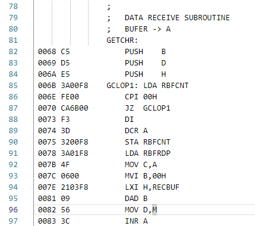
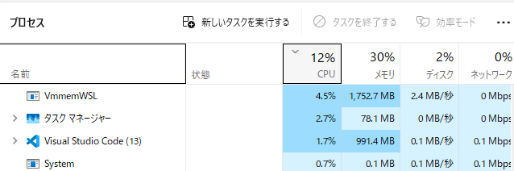
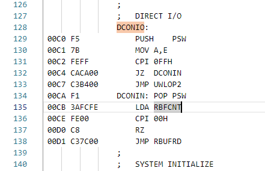
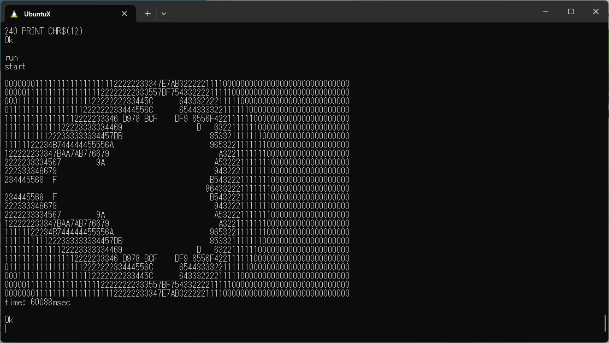

## mameのビルド

新しいマシンでWSLを入れるところから記録をとった。

### wslを入れる

* まず、管理者モードでPowerShellを起動して、`wsl.exe --install`とたたく。
* すぐだんまりになる。
* BIOSで、VT-d を enable にした。
* これで `wsl --install`で入る。
* 再起動してログインすると、Terminalに wsl2が起動した。
* Ubuntu 24.04が入った。

### VScodeを入れる

* Windowsにインストール: PowerShellから`winget install -e -id MicrosoftVisualStudioCode`で入る。
* apt -y update
* apt -y upgrade
* Windows側でVScodeを起動し、"Remote Development" 拡張機能をインストール
* Linux側に`code`をインストール:  
  `sudo snap install code`ではエラーが出る。
* `sudo snap install code --classic`でインストール。
* `code .`でVScodeが起動する。
* 日本語化: `Japanese Language Extensions`をインストール、再起動。
* 白モード: Ctrl-Shift-pでコマンドプロンプトを出して`light`とたたくと白黒反転コマンドが選べる。

### 旧マシンで Ubuntu 24.04を入れた時の話

* Ubuntu-24.04を入れた。
* 別環境、ホームフォルダも新規
* apt -y update
* apt -y upgrade
* gitの設定
* git のインストール(apt install git)

### git-credential-managerのインストール

dotnet-sdk, aspnetcore-runtime をインストールするが、Ubuntu-24.04だと dotnet-sdk-8.0が入ってしまう。

git-credential-managerは、dotnet-sdk-7.0が必要。

### dotnet-dsk-7.0のインストール

[Ubuntu の .NET バックポート パッケージ リポジトリ](https://learn.microsoft.com/ja-jp/dotnet/core/install/linux-ubuntu#ubuntu-net-backports-package-repository)を見て入れる。

Ubuntu の .NET バックポート パッケージ リポジトリを登録する

```
$ sudo add-apt-repository ppa:dotnet/backports
```

Microsoft パッケージ リポジトリを登録する

packages-microsoft-prod.debをダウンロード、インストールする。そして`sudo apt update`

```
# Get OS version info which adds the $ID and $VERSION_ID variables
source /etc/os-release

# Download Microsoft signing key and repository
wget https://packages.microsoft.com/config/$ID/$VERSION_ID/packages-microsoft-prod.deb -O packages-microsoft-prod.deb

# Install Microsoft signing key and repository
sudo dpkg -i packages-microsoft-prod.deb

# Clean up
rm packages-microsoft-prod.deb

# Update packages
sudo apt update
```

これで普通にdotnet-sdk-7.0がインストールできる。

```
# 必要ならアンインストールする。
$ sudo apt-get remove dotnet-sdk-8.0

$ sudo apt upgrade dotnet-sdk-7.0
..
..(わちゃわちゃ入る)
..
$ sudo apt install aspnetcore-runtime-7.0
(既に入っているらしい)

$ dotnet --list-sdks
7.0.119 [/usr/lib/dotnet/sdk]
$ dotnet --list-runtimes
Microsoft.AspNetCore.App 7.0.19 [/usr/lib/dotnet/shared/Microsoft.AspNetCore.App]
Microsoft.NETCore.App 7.0.19 [/usr/lib/dotnet/shared/Microsoft.NETCore.App]
```

### git-credential-manager のインストール・設定

> dotnet-7.0 が必要と聞いていたが、2024-10-6やってみたら、net8.0が必要とおっしゃられた。

> Package git-credential-manager 2.6.0 supports: net8.0 (.NETCoreApp,Version=v8.0) / any

ということで、net7.0 をuninstallしてnet8.0を入れ直した。

```
$ sudo apt-get remove dotnet-sdk-7.0
$ sudo apt-get install dotnet-sdk-8.0
$ sudo apt install aspnetcore-runtime-8.0
$ sudo apt autoremove
```

```
$ dotnet tool install -g git-credential-manager
# インストールされているかのチェック
# .bash_profileにPATHを追加しろと言われた。
$ cat .bash_profile
# Add .NET Core SDK tools
export PATH="$PATH:/home/kuma/.dotnet/tools"
$ which git-credential-manager
# 初期設定 (.gitconfigに書き込まれる）
$ git-credential-manager configure
```

device/personal access tokenしか選択肢が出てこなかった。結局personal access tokenを使った。

LAURELEYでのインストールでは何も出ない。大丈夫か？とりあえず先に進む。

```
kuma@LAURELEY:~$ which git-credential-manager
/home/kuma/.dotnet/tools/git-credential-manager
kuma@LAURELEY:~$ git-credential-manager configure
Configuring component 'Git Credential Manager'...
Configuring component 'Azure Repos provider'...
kuma@LAURELEY:~$
```

## mame を動かす。

* gcc-12を入れた。(gcc-11以上が必要)
* make を入れた。
* sudo ln -s /usr/bin/gcc-12 /usr/bin/gcc

## gcc-12を入れる。

```
$ sudo apt-get install gcc-12
```

## 必要なツールを入れる。

[mameのビルドページ](https://docs.mamedev.org/initialsetup/compilingmame.html)
のDebian/Ubuntuの項目

```
$ sudo apt-get install git build-essential python3 libsdl2-dev libsdl2-ttf-dev libfontconfig-dev libpulse-dev qtbase5-dev qtbase5-dev-tools qtchooser qt5-qmake
```

GCC13-2が入るので、最初のgcc-12インストールは不要だったようだ。

### mameソースコード

```
$ git clone https://github.com/mamedev/mame
```

どうやら make するだけらしい。

```
$ make -j3
```

これでビルドが通ってしまった。ワーニング山盛りで、かつ1時間ぐらいかかったような気もしますが。

# shrunk版を作る

rc2014があることに気づいた。これ中心で縮小版を作る。

メモリとシリアルだけあれば十分。それ以外は片っ端から消してゆく。

とはいえ、devisesの下は通せるものは通す。


## video, audioを消す。

* 一気に消してしまった。
* フォルダを消すだけでは不十分で luaスクリプトの中のエントリもばっさばっさ消した。

## ビルド開始

* `#include "sound/xxxx.h"`でエラーがでる。
* コメントアウトすると、xxxx.hで定義されているクラスの参照でエラー -> 全部コメントアウト
* 

# 新マシンでgit-credential-helperが動かない。

ヘルパは起動するが、ブラウザが起動しない。

```
xdg-open https://github.com/tendai22/
```

で起動するようにしないといけない。ブラウザはWindows版exeを起動する。

xdgのブラウザ定義は、ファイル`~/.local/share/applications/chrome.desktop`を作り、以下の内容を入れておく。

```
[Desktop Entry]
Encoding=UTF-8
Version=1.0
Type=Application
NoDisplay=true
Exec=/mnt/c/Program Files/Google/Chrome/Application/chrome.exe
Name=Chrome
Comment=Microsoft Chrome
MimeType=x-scheme-handler/unknown;x-scheme-handler/about;x-scheme-handler/https;x-scheme-handler/http;text/html;
```

これでも`xdg-open https://github.com/tendai22/`で起動しない。

`Exec`の値に空白が含まれると起動しない。

`xdg-open`はシェルスクリプトなのでデバッグした。コマンドパスに空白が含まれていると、ブラウザの第1引数に`Files/Google/Chrome/Application/chrome.exee`がわたってしまう。

xdg-openを改造して「第１引数が`Files`で始まるときは無理やりshiftする」としてブラウザが起動するようにした。ブラウザでログインできていれば問題なく認証が通り、`git push origin main`が成功するようになった。

> PATHに`/mnt/c/Program Files`を通しておいて、エントリに`Google/Chrome/Application/chrome.exe`を登録しておく手もあるかもしれない。試していないが。

> その後、以下の内容の /usr/bin/www-brower ファイルを作り chmod +x しておくと、
 > `xdg-open https://github.com/tendai22/`でページが開くことを確認した。

```
#! /bin/sh
exec '/mnt/c/Program Files/Google/Chrome/Application/chrome.exe' $*
```

> これで `git push origin rc2014only`が動作した。って、前回もそれで動かしてるやんか。

ということで、

* git-credential-helper をインストールする。

ソースを入れてビルドする方法と、debファイルをダウンロードして入れる方法とあるようだ。今回はdebファイルをインストールしたが。

## WSL環境にブラウザを起動するシェルスクリプトを置けばいいんじゃね？

https://qiita.com/Ryusuke-Kawasaki/items/3ca0e9674ec41238ab8e
にそんなことが書いてあるような気がする。

```
~/bin/chrome.sh
#! /bin/sh
exec "/mnt/c/Program Files/Google/Chrome/Application/chrome.exe" "$@"
```

とシェルスクリプトを作成し、

```
[Desktop Entry]
Encoding=UTF-8
Version=1.0
Type=Application
NoDisplay=true
Exec=/home/kuma/bin/chrome.sh
Name=Chrome
Comment=Microsoft Chrome
MimeType=x-scheme-handler/unknown;x-scheme-handler/about;x-scheme-handler/https;x-scheme-handler/http;text/html;
```

でいけるわ。よかった。

> `xdg-open` も元のものに戻した。

## ビルド再開

## homebrew/*.cpp:

#include video|sound/を含むcppファイルを消した。sbc6809などは残して、ボード内のsoundチップを消すことにした。

z80clockに残っている。z80clock.cppも消していいかもしれない。

linux4004.cppを消した。

machine/6522via.hを復活させた。

このように、

* src/mame/homebrew/ 下でコンパイルできないものを消す(video, sound下のヘッダをインクルードしているcppファイル)
* src/devices/machine/ 下の不足物を足してゆく

を繰り返して進めている。src/devices/machine 下を全部復活させようかとも思ったが、SCSI関連などもあるので、そこまでしていない。

## *.lh ファイル

`src/mame/layout/*.lay` が変換され `build/genated/mame/layout/*.lh` になる。

`src/mame/layout` に `z80dev.lay` を置いておけばよい。

## a1bus, a2bus を消した。

Apple II busだそうだ。

## src/lib/formats の下を掃除した。

使いそうにない *.h, *.cppを全部消した。

## src/lib/formats/all.cpp を通す

この辺バッサリ削り落とした。mfi_dsk.h, dfi_dsk.h をコピーしたが駄目だった。
genieからやり直せばいけると思ったが行けなかった。

とにかく以下をコメントアウトしてall.cppを通した。

```
//	en.add(FLOPPY_MFI_FORMAT); // mfi_dsk.h
//	en.add(FLOPPY_DFI_FORMAT); // dfi_dsk.h
#ifdef HAS_FORMATS_FS_FAT
	en.add(fs::PC_FAT);
#endif

	en.category("Container FM/MFM");
//	en.add(FLOPPY_HFE_FORMAT); // hxchfe_dsk.h
//	en.add(FLOPPY_MFM_FORMAT); // hxcmfm_dsk.h
//	en.add(FLOPPY_TD0_FORMAT); // td0_dsk.h
//	en.add(FLOPPY_IMD_FORMAT); // imd_dsk.h

	en.category("Container MFM");
//	en.add(FLOPPY_D88_FORMAT); // d88_dsk.h
//	en.add(FLOPPY_CQM_FORMAT); // cqm_dsk.h
//	en.add(FLOPPY_DSK_FORMAT); // dsk_dsk.h
```

## genie.lua に記載がある。

```
generate_has_header("CPUS", CPUS)
generate_has_header("SOUNDS", SOUNDS)
generate_has_header("MACHINES", MACHINES)
generate_has_header("VIDEOS", VIDEOS)
generate_has_header("BUSES", BUSES)
generate_has_header("FORMATS", FORMATS)
```

これらについては、各フォルダの中を覗いて`.h`ファイルを探して、`build/generated/has_formats.h`ファイルを生成`HAS_XXXX`マクロを定義しているようだ。

```
#define HAS_FORMATS_FS_FAT
#define HAS_FORMATS_KIM1_CAS
#define HAS_FORMATS_MDOS_DSK
#define HAS_FORMATS_MSX_DSK
#define HAS_FORMATS_NASCOM_DSK
#define HAS_FORMATS_OS9_DSK
#define HAS_FORMATS_WD177X_DSK
```

all.cpp 中で、マクロ `HAS_XXXX`を参照してifdefコンパイルしているので、各フォルダのヘッダを消すことでシュリンクを進めるべき。

## コンパイル継続

* COPYINGがない。COPYINGをコピーした。
* mpu401.hがない。src/devices/machine/mpu401.*をコピーした。
* src/devices/bus/cbus/pc9801_118.h: sound/ymopn.h。
  cbusを外す。
* scripts/src/bus.luaからエントリ相当削除した。マクロ定義で無効かできるようなのだが、その定義をどのように渡しているのかがわかっていない。luaよく知らない。
* imagedev/floppy.hのビルドが通らない。#include "sound/samples.h"をコメントアウトしたかららしい。
* floppy_sound_device クラス定義を削除して進めた。
* machine/intelfsh.\*, ds1302.\*, コピーした。

## rc2014/sound.cppどうする？

これを使わないようにする。bus.luaからsound.cpp/.hを外す。makeたたくだけでmakefile再構成される(REGENIE=1が効いているのかな?)。

## bus/rs232c, bus/s100 からデバイスを外す。

bus.luaの両エントリから files 中の使わなさそうなエントリを消していった。

## machine/diablo_hd.\*

diablo_hd.h/cppファイルを復活させた。

## machine/下のファイル

エラーが出るたびにコピーしていった。

```
pla.h, cammu.h, gt913_kbd.h, vic_pl192.h, diablo_hd.h
```

## cpu/h6280/h6280.h が sound/c6280.h を求めている

これはsound/c6280.hを外してコンパイルを通す。ソースを編集し関連クラス定義を消した。

## cpu/h8/swx00.h

Yamaha sound generator swx00だそうなので、swx00.h/cppを外す。

cpu.luaの swx00.h/cppエントリを消した。

## cpu/m6502/gew7.cpp

Yamaha GEW7, GEW7I, GEW7S (65c02-based)サウンドデバイスだそうなので、これもcpu.luaから消す。

## cpu/m6502/rp2a03.cpp

6502, NES variant、もったいないが多分使わないので外す。

## cpu/mips/mips3.cpp:

video/ps2gs.hで引っかかる。video/ps2*, machine/ps2* をコピーした。

## cpu/nec/v5x.h:

machine/am8517a.h がない。DMAコントローラらしいのでコピーした。

## imagedev/cdromimg.cpp

1. check_if_gd()がない

src/lib/util/chd.h:に enum class errorを返す check_if_gd()を作った。

```
	enum error check_is_cd() { return is_cd() ? error(0) : error::METADATA_NOT_FOUND; }
	enum error check_is_gd() { return is_gd() ? error(0) : error::METADATA_NOT_FOUND; }
	enum error check_is_dvd() { return is_dvd() ? error(0) : error::METADATA_NOT_FOUND; }
```

これで適切かどうかはわからない。

2. error: invalid use of incomplete type ‘class floppy_sound_device’

結局、`DEFINE_DEVICE_TYPE(FLOPPYSOUND, floppy_sound_device, "flopsnd", "Floppy sound")`

の第1引数FLOPPYSOUNDがテンプレート型になっていてそれで引っかかった。このマクロをコメントアウトすることで乗り切った。

## machine.lua エントリ消しまくり、machine/*.h/cpp コピーしまくり

でなんとかビルドして、

ld: -lshared がない、

まで漕ぎつけた。

## -lshared を消した

-lshared を LIBS に追加しているmakefileを見つけて消した。
makefileは生成物で、生成過程のどこで追加しているのかがよくわからない。

## drivlist.o で参照しているブツが大量にundefined

なので、drivlist.o がどうやってできているかを見た。

* もちろん、drivlist.cpp をコンパイルしている。
* drivlist.cpp は自動生成物である。
* genie で生成しているらしい。どのようにして生成しているかは読みこなせていない。
* mame.list を元ネタとしていることが分かった
* mame.list を消して make -d したときのログ参照(以下)

```
Reaping winning child 0x555974c76f70 PID 5996
Removing child 0x555974c76f70 PID 5996 from chain.
    Successfully remade target file '../../../../linux_gcc/obj/x64/Release/src/mame/mame.o'.
    Considering target file '../../../../linux_gcc/obj/x64/Release/generated/mame/mame/drivlist.o'.
     File '../../../../linux_gcc/obj/x64/Release/generated/mame/mame/drivlist.o' does not exist.
      Considering target file '../../../../generated/mame/mame/drivlist.cpp'.
       File '../../../../generated/mame/mame/drivlist.cpp' does not exist.
        Considering target file '../../../../../src/mame/mame.lst'.
         File '../../../../../src/mame/mame.lst' does not exist.
         Looking for an implicit rule for '../../../../../src/mame/mame.lst'.
         No implicit rule found for '../../../../../src/mame/mame.lst'.
         Finished prerequisites of target file '../../../../../src/mame/mame.lst'.
        Must remake target '../../../../../src/mame/mame.lst'.
make[2]: *** No rule to make target '../../../../../src/mame/mame.lst', needed by '../../../../generated/mame/mame/drivlist.cpp'.  Stop.
Reaping losing child 0x55d2e146a7e0 PID 5990
make[1]: *** [Makefile:112: mame] Error 2
Removing child 0x55d2e146a7e0 PID 5990 from chain.
Reaping losing child 0x55a042f6c450 PID 419
make: *** [makefile:1288: linux_x64] Error 2
Removing child 0x55a042f6c450 PID 419 from chain.
kuma@:~/mame-test$ exit
```

* mame.list 中には膨大な数のエントリがあった。

## mame.list 空ファイルでビルドしてみた。

リンクフェーズに入ったが、やはり -lshared がないと言われた。

```
kuma@:~/mame-test$ touch src/mame/mame.lst
kuma@:~/mame-test$ make
GCC 12.4.1 detected
fatal: No names found, cannot describe anything.
Building driver list...
0 driver(s) found
Compiling generated/mame/mame/drivlist.cpp...
Compiling generated/version.cpp...
Linking mame...
/usr/bin/ld: cannot find -lshared
collect2: error: ld returned 1 exit status
make[2]: *** [mame.make:269: ../../../../../mame] Error 1
make[1]: *** [Makefile:112: mame] Error 2
make: *** [makefile:1288: linux_x64] Error 2
kuma@:~/mame-test$
```

## -lshared

`find . -type f |xargs grep lshared`を実行して探す。`mame.make`の中にあった。

```
./build/projects/sdl/mame/gmake-linux/mame.make:  LIBS               += $(LDDEPS) -ldl -lrt -lSDL2 -lm -lpthread -lutil -lshared -lGL -lasound -lQt5Widgets -lQt5Gui -lQt5Core -lpulse -lX11 -lXinerama -lXext -lXi -lSDL2_ttf -lfontconfig -lfreetype
./build/projects/sdl/mame/gmake-linux/mame.make:  LIBS               += $(LDDEPS) -ldl -lrt -lSDL2 -lm -lpthread -lutil -lshared -lGL -lasound -lQt5Widgets -lQt5Gui -lQt5Core -lpulse -lX11 -lXinerama -lXext -lXi -lSDL2_ttf -lfontconfig -lfreetype
./build/projects/sdl/mame/gmake-linux/mame.make:  LIBS               += $(LDDEPS) -ldl -lrt -lSDL2 -lm -lpthread -lutil -lshared -lGL -lasound -lQt5Widgets -lQt5Gui -lQt5Core -lpulse -lX11 -lXinerama -lXext -lXi -lSDL2_ttf -lfontconfig -lfreetype
./build/projects/sdl/mame/gmake-linux/mame.make:  LIBS               += $(LDDEPS) -ldl -lrt -lSDL2 -lm -lpthread -lutil -lshared -lGL -lasound -lQt5Widgets -lQt5Gui -lQt5Core -lpulse -lX11 -lXinerama -lXext -lXi -lSDL2_ttf -lfontconfig -lfreetype
./build/projects/sdl/mame/gmake-linux/mame.make:  LIBS               += $(LDDEPS) -ldl -lrt -lSDL2 -lm -lpthread -lutil -lshared -lGL -lasound -lQt5Widgets -lQt5Gui -lQt5Core -lpulse -lX11 -lXinerama -lXext -lXi -lSDL2_ttf -lfontconfig -lfreetype
./build/projects/sdl/mame/gmake-linux/mame.make:  LIBS               += $(LDDEPS) -ldl -lrt -lSDL2 -lm -lpthread -lutil -lshared -lGL -lasound -lQt5Widgets -lQt5Gui -lQt5Core -lpulse -lX11 -lXinerama -lXext -lXi -lSDL2_ttf -lfontconfig -lfreetype
```

## リンクエラー

未定義が大量に出る。

```
osdobj_common.cpp:(.text+0x4334): undefined reference to `SOUND_DSOUND'
/usr/bin/ld: osdobj_common.cpp:(.text+0x4341): undefined reference to `SOUND_XAUDIO2'
/usr/bin/ld: osdobj_common.cpp:(.text+0x434e): undefined reference to `SOUND_COREAUDIO'
/usr/bin/ld: osdobj_common.cpp:(.text+0x435b): undefined reference to `SOUND_JS'
/usr/bin/ld: osdobj_common.cpp:(.text+0x4368): undefined reference to `SOUND_SDL'
/usr/bin/ld: osdobj_common.cpp:(.text+0x4375): undefined reference to `SOUND_PORTAUDIO'
/usr/bin/ld: osdobj_common.cpp:(.text+0x4382): undefined reference to `SOUND_PULSEAUDIO'
/usr/bin/ld: osdobj_common.cpp:(.text+0x438f): undefined reference to `SOUND_NONE'
```

以下の定義をコメントアウト。

```
//MODULE_DEFINITION(SOUND_DSOUND, osd::sound_direct_sound)
```

```
//REGISTER_MODULE(m_mod_man, SOUND_PULSEAUDIO);
```

これは`NO_USE_PULSEAUDIO`マクロを定義すれば外せる。

```
//REGISTER_MODULE(m_mod_man, SOUND_XAUDIO2);
```
の2エントリがある。
```
//MODULE_DEFINITION(SOUND_XAUDIO2, osd::sound_xaudio2)
```

どうやら、コンパイル時に NO_USE_XXXXAUDIO を定義すると外せるらしい。

> makefile 中にNO_USE_PORTAUDIO = 1, NO_USE_PULSEAUDIO = 1がある。他はない。
> とりあえず両者を1にしておいた。

## SDL_GameControllerXXX

```
input_sdl.cpp:(.text+0x37d7): undefined reference to `SDL_GameControllerGetSerial'
/usr/bin/ld: input_sdl.cpp:(.text+0x38ba): undefined reference to `SDL_JoystickGetSerial'
/usr/bin/ld: ../../../../linux_gcc/bin/x64/Release/mame_mame/libosd_sdl.a(input_sdl.o): in function `osd::(anonymous namespace)::sdl_joystick_module::handle_event(SDL_Event const&)':
input_sdl.cpp:(.text+0x3bf1): undefined reference to `SDL_JoystickGetSerial'
/usr/bin/ld: ../../../../linux_gcc/bin/x64/Release/mame_mame/libosd_sdl.a(input_sdl.o): in function `osd::(anonymous namespace)::sdl_game_controller_device::configure(osd::input_device&)':
input_sdl.cpp:(.text+0x4bf8): undefined reference to `SDL_GameControllerGetType'
/usr/bin/ld: input_sdl.cpp:(.text+0x4e8b): undefined reference to `SDL_GameControllerHasAxis'
/usr/bin/ld: input_sdl.cpp:(.text+0x548c): undefined reference to `SDL_GameControllerHasButton'
/usr/bin/ld: input_sdl.cpp:(.text+0x54d8): undefined reference to `SDL_GameControllerHasAxis'
/usr/bin/ld: input_sdl.cpp:(.text+0x5791): undefined reference to `SDL_GameControllerHasButton'
```

ソース参照箇所を全部コメントアウトした。とりあえず false を入れて置けばよさそうだったので。

## floppy_imaga::~floppy_image()

デストラクタ未定義とのこと、src/lib/formats/flopimg.* をコピー追加しておいた。

ここでmake clean して再ビルド。

## mame.lst 自動生成？

make clean したが make.lst は前のまま。

mame.lst を消して make clean したが、mame.lstができなかった。
ということで、これは自動生成とみなさない、でよさそう。

消したままでビルドを進めてみる。

```
Compiling src/devices/cpu/z80/z80.cpp...
Compiling src/devices/cpu/z80/z80n.cpp...
Archiving liboptional.a...
make[2]: *** No rule to make target '../../../../../src/mame/mame.lst', needed by '../../../../generated/mame/mame/drivlist.cpp'.  Stop.
make[2]: *** Waiting for unfinished jobs....
Compiling src/mame/mame.cpp...
make[1]: *** [Makefile:112: mame] Error 2
make: *** [makefile:1288: linux_x64] Error 2
kuma@:~/mame-test$
```

ということで、ここまでmame.lstは参照されていない。

## mame.lst をバッサリ削る。

homebrew/rc2014 以外をばっさり削った。

これでリンクするとundefined多数。floppy_imaga, ata_interface, intelsh, 39sf40_deviceなど。romram.cppからの参照が多いので、romram.cpp内部をバッサリ削ることになるだろう。

## upd765.cpp/.hを外した。

## intelfsh.cpp/.hを追加した。

## コンパイル通った！

```
Compiling src/devices/cpu/z80/z80.cpp...
Compiling src/devices/cpu/z80/z80n.cpp...
Compiling src/devices/machine/exorterm.cpp...
Compiling src/devices/machine/ie15.cpp...
Archiving liboptional.a...
Compiling src/mame/mame.cpp...
Building driver list...
Compiling generated/version.cpp...
40743 driver(s) found
Compiling generated/mame/mame/drivlist.cpp...
Linking mame...
kuma@LAURELEY:~/mame$
```

mame.make の -lshared も外していないのに、なんで？

## と思ったらmameオリジナルだった。がっかり。

## floppy.o, pc_dsk.oでundefined多発

imagedev/の下をすべて外してみた。

## ドバドバ消した。

cpu.lua, machine.lua

ビルドして、

```
Compiling src/devices/machine/exorterm.cpp...
Compiling src/devices/machine/ie15.cpp...
Archiving liboptional.a...
make[2]: *** No rule to make target '../../../../../src/mame/mame.cpp', needed by '../../../../linux_gcc/obj/x64/Release/src/mame/mame.o'.  Stop.
make[2]: *** Waiting for unfinished jobs....
make[1]: *** [Makefile:112: mame] Error 2
make: *** [makefile:1290: linux_x64] Error 2
kuma@LAURELEY:~/mame$
```

mame.cppがない。今日はここまで。

## libformats.aが存在しない。で黙って止まる。

src/

```
Live child 0x558b1f9d4660 (../../../../linux_gcc/bin/x64/Release/mame_mame/libformats.a) PID 3540
Archiving libformats.a...
Reaping winning child 0x558b1f9d4660 PID 3540
Live child 0x558b1f9d4660 (../../../../linux_gcc/bin/x64/Release/mame_mame/libformats.a) PID 3541
Reaping winning child 0x558b1f9d4660 PID 3541
Live child 0x558b1f9d4660 (../../../../linux_gcc/bin/x64/Release/mame_mame/libformats.a) PID 3543
ar: '../../../../linux_gcc/bin/x64/Release/mame_mame/libformats.a': No such file
Reaping losing child 0x558b1f9d4660 PID 3543
make[2]: *** [formats.make:266: ../../../../linux_gcc/bin/x64/Release/mame_mame/libformats.a] Error 1
Removing child 0x558b1f9d4660 PID 3543 from chain.
Reaping losing child 0x5638717e51e0 PID 3539
make[1]: *** [Makefile:28: formats] Error 2
Removing child 0x5638717e51e0 PID 3539 from chain.
Reaping losing child 0x55d76b5427e0 PID 32746
make: *** [makefile:1288: linux_x64] Error 2
Removing child 0x55d76b5427e0 PID 32746 from chain.
kuma@:~/mame-test$ exit
```

formats.luaのエントリをall.cppだけ復活させて再ビルドすると、-lsharedまで来た。再度-lsharedを消してビルドを進める。

> -lshared は build/products/sdl/gmake-linux/mame.make にある。


## romram.cpp

./src/devices/bus/rc2014/romram.cpp

romram.cppを外すわけにはいかない。この中のundefinedを削除してゆく。

* メンバ m_flash 削除
* デバイス sc119_rom 削除

## serial.cpp

./src/devices/bus/rc2014/serial.cpp

rc2014パッケージからserial.cppを外してみる。
-lsharedが出たところで中断。今日はここまで。いったんcommit/push

## ビルド時間の短縮

3rdpartyなんて毎回再ビルドしなくてもいいんじゃないか。bus.luaを書き換えたらリンク対象ファイルリストだけ再計算すればいいんじゃないか。

ターゲットcleanでは、buildディレクトリ以下をすべて消している。これが消し過ぎになっていたと推察する。

ターゲットallcleanを作って全クリアをそちらに移動。

ターゲットcleanでは、buildsの下で消すもの最小限とする。

例えば、

```
allclean: genieclean
	@echo Cleaning...
	-$(SILENT)rm -f language/*/*.mo
	-$(SILENT)rm -rf $(BUILDDIR)
	-$(SILENT)rm -rf 3rdparty/bgfx/.build

clean:
	@echo Cleaning...
	-$(SILENT)rm -rf $(BUILDDIR)/projects/sdl/mame/gmake-linux
```

gmake-linux直下の`*.make`だけ消して再構成するようにしてみる。

### lib*.aを消す。

`bus.lua`からエントリを消して`make clean`だけでは足りなかった。

```
rm build/linux_gcc/bin/x64/Release/mame_mame/lib*.a
```

これでmakeで再ビルドが効率的にできるようになった。

`make clean`なしで`rm ..../lib*.a`だけでもいいかもしれない。

## debugimgui.o ... floopy_device_image 

これは debugimgui.cpp を触って外すしかないだろう。

`src/osd/modules/debugger/debugimgui.cpp`

floppy形式関連の処理をばっさと切った。コンパイルは通った。
画面処理全体に影響がでそうだ。

が、先に進もう。

## modules.cpp:

```
modules.cpp:(.text+0x83): undefined reference to `RC2014_SERIAL_IO'
/usr/bin/ld: modules.cpp:(.text+0x95): undefined reference to `RC2014_DUAL_SERIAL_40P'
/usr/bin/ld: modules.cpp:(.text+0xa7): undefined reference to `RC2014_COMPACT_FLASH'
/usr/bin/ld: modules.cpp:(.text+0xb9): undefined reference to `RC2014_ROM_RAM_512'
/usr/bin/ld: modules.cpp:(.text+0xdd): undefined reference to `RC2014_YM2149_SOUND'
/usr/bin/ld: modules.cpp:(.text+0xef): undefined reference to `RC2014_AY8190_SOUND'
/usr/bin/ld: modules.cpp:(.text+0x101): undefined reference to `RC2014_82C55_IDE'
/usr/bin/ld: modules.cpp:(.text+0x113): undefined reference to `RC2014_IDE_HDD'
/usr/bin/ld: modules.cpp:(.text+0x125): undefined reference to `RC2014_FDC9266'
/usr/bin/ld: modules.cpp:(.text+0x137): undefined reference to `RC2014_WD37C65'
/usr/bin/ld: modules.cpp:(.text+0x149): undefined reference to `RC2014_MICRO'
```

こういうのが一杯出る。device.option_addで指定しているので、これらを片っ端から消す。

```
	//device.option_add("serial", RC2014_SERIAL_IO);
	//device.option_add("sio_40p", RC2014_DUAL_SERIAL_40P);
```

## 一応リンクも通った。

```
kuma@:~/mame-test$ make
GCC 12.4.1 detected
fatal: No names found, cannot describe anything.
Compiling src/devices/bus/rc2014/modules.cpp...
Archiving liboptional.a...
Linking mame...
kuma@:~/mame-test$
```

さてどうなるか。

## バイナリが起動しない。

```
kuma@:~/mame-test$ ./mame
./mame: /lib/x86_64-linux-gnu/libstdc++.so.6: version `GLIBCXX_3.4.30' not found (required by ./mame)
./mame: /lib/x86_64-linux-gnu/libstdc++.so.6: version `GLIBCXX_3.4.29' not found (required by ./mame)
./mame: /lib/x86_64-linux-gnu/libstdc++.so.6: version `CXXABI_1.3.13' not found (required by ./mame)
kuma@:~/mame-test$
```

GCC-12のインストールに失敗している様子。

## allclean してフルビルド

make allclean してフルビルドした。

今度は、`osd::debugger::qt::` 関連で大量のundefinedが出た。

make clean が未完成状態ということ。

## osd/modules/debugger コードを外してビルド

make all clean

おそらく、`osdobj_common.cpp`の`#include "modules/debugger/debug_modules.h"`を外してビルドすることになるだろう。

エラーが出たので、osdobj_common.cppから、

```
	//REGISTER_MODULE(m_mod_man, DEBUG_WINDOWS);
	//REGISTER_MODULE(m_mod_man, DEBUG_QT);
	//REGISTER_MODULE(m_mod_man, DEBUG_IMGUI);
	//REGISTER_MODULE(m_mod_man, DEBUG_GDBSTUB);
	//REGISTER_MODULE(m_mod_man, DEBUG_NONE);
```

をコメントアウトしたらリンクが通った。

## osdobj_common.cpp

ここでosd関連モジュールの組み込みしているようだ。
なんとかNONEがいっぱいあるので、なんとかNONEだけ残して他をコメントアウトしてみよう。

SOUND_NONEも消していたが、これも復活させるとよいかもしれない。

osd関連のモジュール組み込みは、ここでコメントアウトする、かつ、関連ソースコードをビルド対象から除外する。

ちょっと見えてきた。

1. モジュールの組み込みは、`REGISTER_MODULE`で行う。

```
	REGISTER_MODULE(m_mod_man, MONITOR_SDL);
```

2. `MODULE_DEFINITION`が、`REGISTER_MODULE`の名前(例: MONITOR_SDL)とコード実体(クラス)と対応付ける。

```
MODULE_DEFINITION(MONITOR_SDL, sdl_monitor_module)
```

3. クラス名からファイル名を探し出し、*.luaの組み込み定義から外す。

これでいけそうだ。

## GCC-12 再ビルド

https://stackoverflow.com/questions/70835585/how-to-install-gcc-12-on-ubuntu

git cloneしたgcc-sourceにて


```
$ cd gcc-source
$ git branch -a
$ git checkout remotes/origin/releases/gcc-12
```

ビルドディレクトリを用意して、configure

--prefix指定なし、デフォルトで指定した。

```
mkdir ../gcc-12-build
$ cd ../gcc-12-build/
$ ./../gcc-source/configure --enable-languages=c,c++
```

必要なライブラリを確認した。すべて最新版がすでに入っていた。

```
$ sudo apt-get install libmpfrc++-dev libmpc-dev libgmp-dev gcc-multilib
Reading package lists... Done
Building dependency tree
Reading state information... Done
gcc-multilib is already the newest version (4:9.3.0-1ubuntu2).
libmpc-dev is already the newest version (1.1.0-1).
libmpfrc++-dev is already the newest version (3.6.6+ds-1).
libgmp-dev is already the newest version (2:6.2.0+dfsg-4ubuntu0.1).
0 upgraded, 0 newly installed, 0 to remove and 0 not upgraded.
```

以前の configure のままで進んでOKだろう。

ビルド開始した。

```
$ make -j5
```

今日は時間切れになりそう。

## 結局、原因は、LD_LIBRARY_PATH 不備だったらしい。

```
    LD_LIBRARY_PATH="/usr/local/lib64"
    LD_RUN_PATH="/usr/local/lib64"
    export LD_LIBRARY_PATH
    export LD_RUN_PATH
```

を、.profile に含めることでmame起動してもライブラリがないと言われなくなった。

```
Libraries have been installed in:
   /home/kuma/opt/gcc-12.4.1/lib/../lib64

If you ever happen to want to link against installed libraries
in a given directory, LIBDIR, you must either use libtool, and
specify the full pathname of the library, or use the `-LLIBDIR'
flag during linking and do at least one of the following:
   - add LIBDIR to the `LD_LIBRARY_PATH' environment variable
     during execution
   - add LIBDIR to the `LD_RUN_PATH' environment variable
     during linking
   - use the `-Wl,-rpath -Wl,LIBDIR' linker flag
   - have your system administrator add LIBDIR to `/etc/ld.so.conf'

See any operating system documentation about shared libraries for
more information, such as the ld(1) and ld.so(8) manual pages.
----------------------------------------------------------------------
 /usr/bin/mkdir -p '/home/kuma/opt/gcc-12.4.1/share/info'
 /usr/bin/install -c -m 644 ./libitm.info '/home/kuma/opt/gcc-12.4.1/share/info'
 install-info --info-dir='/home/kuma/opt/gcc-12.4.1/share/info' '/home/kuma/opt/gcc-12.4.1/share/info/libitm.info'
make[4]: Leaving directory '/home/kuma/gcc-12-build/x86_64-pc-linux-gnu/libitm'
make[3]: Leaving directory '/home/kuma/gcc-12-build/x86_64-pc-linux-gnu/libitm'
make[2]: Leaving directory '/home/kuma/gcc-12-build/x86_64-pc-linux-gnu/libitm'
make[1]: Leaving directory '/home/kuma/gcc-12-build'
$ echo $LIBDIR
```

LD_LIBRARY_PATH, LD_RUN_PATH を環境変数に追加することで動作した。

## exception: All sound modules failed to initialize

```
kuma@PC-C2387:~/mame-test$ ./mame
Ignoring MAME exception: All sound modules failed to initialize
Fatal error: All sound modules failed to initialize
```

sound/none.cppを復活させた。

## -verbose オプション

osd_printf_verbose関数のログ出力を有効にするために、-verboseオプションを付けて起動する。

## メンバm_monitor_moduleを削除した。

monitorrendor モジュールを削除したため、osd_common_t クラスから m_monitor_module を削除した。メンバ定義と参照箇所、元クラスを削除して再ビルド、実行した。

## Warning + Core dump

```
$ ./mame
Warning: -video none doesn't make much sense without -seconds_to_run
Segmentation fault (core dumped)
```

ということで、この Warning メッセージからソースを探る。

video_none::init関数内の最初のチェック。

## gdb 上で実行してみた

```
(gdb) r
Starting program: /home/kuma/mame-test/mame
[Thread debugging using libthread_db enabled]
Using host libthread_db library "/lib/x86_64-linux-gnu/libthread_db.so.1".
warning: File "/usr/local/lib64/libstdc++.so.6.0.30-gdb.py" auto-loading has been declined by your `auto-load safe-path' set to "$debugdir:$datadir/auto-load".
To enable execution of this file add
        add-auto-load-safe-path /usr/local/lib64/libstdc++.so.6.0.30-gdb.py
line to your configuration file "/home/kuma/.gdbinit".
To completely disable this security protection add
        set auto-load safe-path /
line to your configuration file "/home/kuma/.gdbinit".
For more information about this security protection see the
"Auto-loading safe path" section in the GDB manual.  E.g., run from the shell:
        info "(gdb)Auto-loading safe path"
[Detaching after fork from child process 2960]
Warning: -video none doesn't make much sense without -seconds_to_run
[New Thread 0x7ffff3004700 (LWP 2961)]

Thread 1 "mame" received signal SIGSEGV, Segmentation fault.
0x0000000001a1b108 in emulator_info::draw_user_interface(running_machine&) ()
(gdb) quit
```

と言われたので、~/.gdbinit に、

```
add-auto-load-safe-path /usr/local/lib64/libstdc++.so.6.0.30-gdb.py
```

を追記して再度 gdb mame 起動、run すると、

```
(gdb) r
Starting program: /home/kuma/mame-test/mame
[Thread debugging using libthread_db enabled]
Using host libthread_db library "/lib/x86_64-linux-gnu/libthread_db.so.1".
[Detaching after fork from child process 3104]
Warning: -video none doesn't make much sense without -seconds_to_run
[New Thread 0x7ffff3004700 (LWP 3105)]

Thread 1 "mame" received signal SIGSEGV, Segmentation fault.
0x0000000001a1b108 in emulator_info::draw_user_interface(running_machine&) ()
(gdb) bt
#0  0x0000000001a1b108 in emulator_info::draw_user_interface(running_machine&) ()
#1  0x000000000172951b in video_manager::frame_update(bool) ()
#2  0x000000000167b215 in running_machine::start() ()
#3  0x000000000167ddc5 in running_machine::run(bool) ()
#4  0x0000000001a1f908 in mame_machine_manager::execute() ()
#5  0x0000000001ad4705 in cli_frontend::start_execution(mame_machine_manager*, std::vector<std::__cxx11::basic_string<char, std::char_traits<char>, std::allocator<char> >, std::allocator<std::__cxx11::basic_string<char, std::char_traits<char>, std::allocator<char> > > > const&) ()
#6  0x0000000001ad48fb in cli_frontend::execute(std::vector<std::__cxx11::basic_string<char, std::char_traits<char>, std::allocator<char> >, std::allocator<std::__cxx11::basic_string<char, std::char_traits<char>, std::allocator<char> > > >&) ()
#7  0x0000000001a1b0e1 in emulator_info::start_frontend(emu_options&, osd_interface&, std::vector<std::__cxx11::basic_string<char, std::char_traits<char>, std::allocator<char> >, std::allocator<std::__cxx11::basic_string<char, std::char_traits<char>, std::allocator<char> > > >&) ()
#8  0x000000000049cdcd in main ()
(gdb)
```

となった。いよいよ、emulator_info::start_frontend まで来た。frontend を外すか、シリアルデバイスで動くように改造するか。

その前に、-g オプションを付けてコンパイルしておきたい。CFLAGS に -g を追加する方法を探す。

## CFLAGS に -g を追加する。

と思ってソースツリーを漁ったが、explicit に CFLAGS を参照・定義・更新しているところが見つからなかった。

makefilesはGENieを使って生成されているようだ。ここは一発 GENie を調べてみよう。

## GENie

[GENie](https://github.com/bkaradzic/genie)はgithub.com 上にリポジトリがある。

* project generator tool: ビルド環境(project)を生成するツール。
* Lua script から projectを生成する。
* setting 一つで、複数のプロジェクトを生成できる。
* 対応ビルドツール(supported project genetors)
  + GNU Makefile
  + JSON Compilation Database (何じゃこれ?)
  + Ninja
  + Visual Studio (2010,12,13,15,17,19,2022)
  + Xcode
  だそうです。

MAMEはGENieを使ってビルド環境を構築している様子。

Documentation が scriptiong reference、リファレンスしかなく「辞書項目の列挙」状態で、「読める」文書を見つけられていない。

* BSD 3-clause Lisence の様子。

* premake (Release 4.4 beta 5)からforkした様子。

* [premake5についての解説](https://qiita.com/ousttrue/items/6d837d6daba47b51bd8e)。GENieの全体構造、Luaスクリプトお作法の参考になりそう。

# まっさらマシンに WSL2 入れてみた。

同人誌の環境構築ネタを補強した。本LOG.md最初の記載にマージする。

環境整備でやったこと。

### wslのインストール

```
> wsl.exe --install Ubuntu-22.04
```

```
$ sudo apt-get update
$ sudo apt-get upgrade
```

### VScode を使えるようにする。

最初に Windows版 VScode をインストール、Remote - WSL Extensionをインストールするのだ。これで WSL内部で `code .`と叩くとうまくいく。

今回は Windows版を入れずに、Linux 版 VScode をインストールしてしまい往生した。これでも code . と叩くと起動するのだ。WSL の Xサーバ機能がすごすぎるということなのだが、

* 日本語文字が豆腐になる。/usr/share/fonts/windows にフォントファイルをコピー、fc-cacheすると日本語文字は表示されるが MS Gothic で汚い。
* 日本語IME入力ができない。これは致命的。

```
$ sudo apt-get remove code
```

で Linux版を削除したが、今度は `code .`と叩いてもcodeが起動しない。

これは、`/mnt/c/Users/no-kumagai/AppData/Local/Programs/Microsoft VS Code/bin` にある `code`が vscode-server らしく、これを手で起動することでサーバのダウンロードが始まり、同時に PATH にも入った。

以後は `code .`と叩くと Windows版 VScode が起動して、日本語文字入力もできるようになった。

当たり前だが、

* Windows版 VScode をインストール。
* Windows版 VScode を起動して、Remote - WSL 拡張機能をインストールする

ことで動作する。今回はまっさらのWindowsから立ち上げているので、VScode をインストールする前に WSL内部でがんがん作業を進めていたのが敗因。

> Linux版remove後に、rehash していればよかったのかもしれない。もとから /mnt/c... はパスに入っていて、/usr/bin/code がなくなったので起動できないといわれていたように見えた。rehash も忘れるとは焼きが回ったもんだ。

### GCC-12 のインストール

#### 準備

* GNU make, flex, bison を事前に手でインストールしておく。  
  以下の download_prerequisites スクリプトでも入れてくれない。

半ば意図的に Ubuntu-20.44 を入れている。なので、apt-get install gcc で入る GCC は Version 12 ではない。手でインストールする。

#### インストール

[dsrevkovさんのスクリプト](https://gist.github.com/dstrebkov/ebe070c1e35d94f859c6cacae8d642ef)がよろしい。大まかな手順は

* `https://gcc.gnu.org/git/gcc,git`をcloneする。
* `remotes/origin/releases/gcc-12`をcheckoutする。
* `./contrib/download_prerequisites`(シェルスクリプト)を実行する。これで例の数値計算ライブラリ系のtarballがダウンロードされる。
* gcc-12-build ディレクトリをつくる。
* gcc-12-buildの下で configureを実行する。
  + --prefix=/home/kuma/opt/gcc-12.4.1 (手元にインストールする前提)
  + --enable-languages=c,c++,fortran,go
  + --disable-multilib
* make -j5
* make install (手元にインストールするので sudo不要)

#### パスを通す。

* .profile に /home/kuma/opt/gcc-12.4.1/bin を入れておくこと。
* LD_LIBRARY_PATH, LD_RUN_PATHの設定

```
# set envs for gcc-12.4.1
if [ -d "$HOME/opt/gcc-12.4.1/bin" ] ; then
    PATH="$HOME/opt/gcc-12.4.1/bin:$PATH"
fi
LD_LIBRARY_PATH=$HOME/opt/gcc-12.4.1/lib64
LD_RUN_PATH=$HOME/opt/gcc-12.4.1/lib64
export LD_LIBRARY_PATH LD_RUN_PATH
```

# mame-test のcloseとビルド

まっさらな環境ではビルドできない。sdl2, alsa, fontconfig, Qt5Widgetsがないといわれて怒られる。

ならば、この4つなしでもビルドできるようにしようじゃないか。

## alsa

alsa を外す方法は不明。pkg-config で alsa.pcが見つからないと言っている。が、pkg-configを呼び出しているところがわからない。configure でやっているらしいので、luaスクリプトを見てもわからない。portaudioが怪しい。

portaudioを切り離した(3rdparty/portaudioディレクトリ以下を抹消した)つもりだが、まだ出てくる。

## sdl2

これは、 OSD := nosdl として nosdlフォルダを掘り、nosdl.lua, nosdl_cfg.luaを適当に作成した。

## bgfx

bgfxも MAME_FILE をコメントアウトしまくった。

```
GCC 12.4.1 detected
fatal: No names found, cannot describe anything.
Compiling src/osd/modules/opengl/gl_shader_mgr.cpp...
次のファイルから読み込み:  ../../../../../src/osd/modules/opengl/gl_shader_tool.h:26,
         次から読み込み:  ../../../../../src/osd/modules/opengl/gl_shader_mgr.h:8,
         次から読み込み:  ../../../../../src/osd/modules/opengl/gl_shader_mgr.cpp:4:
../../../../../src/osd/modules/opengl/osd_opengl.h:39:26: 致命的エラー: SDL2/SDL_version.h: そのようなファイルやディレクトリはありません
   39 |                 #include <SDL2/SDL_version.h>
      |                          ^~~~~~~~~~~~~~~~~~~~
コンパイルを停止しました。
make[2]: *** [osd_noosd.make:1026: ../../../../linux_gcc/obj/x64/Release/osd_noosd/src/osd/modules/opengl/gl_shader_mgr.o] エラー 1
make[1]: *** [Makefile:19: osd_noosd] エラー 2
make: *** [makefile:1297: linux_x64] エラー 2
```

src/osd/modules/opengl も外したい。今日(11/15)はここまで。

# リンク遊びは控えて、ソースコードにまじめに取り組む。

* cpu を構成・起動して、それが必要とする rom/ram デバイスのみでハードウェアを構成する。
* z80 を題材に……と思ったが、物が多すぎて検索結果がとっちらかる。
* マイナーなCPU, 68HC11 で当ててみよう。

## 68hc11を使うハードウェア

cp2024, cdd2000 の2つぐらいか？

### cp2024 ... 25inch FDD box?

68hc11を搭載したFDCコントローラかな？いや、ConnerのHDDのようだ。cs0, cs1の名前も見える。

```
#ifndef MAME_BUS_ATA_CP2024_H
#define MAME_BUS_ATA_CP2024_H
```

このあたりから、ATA接続するデバイスに見える。ワンボードコンピュータとしてはわかりやすいデバイスだが。

### cdd2000

これは CR-Rデバイスらしい。

とすると、

* sdl2, alsa, ... なしでビルドして、
* cp2024 をデバイスとして立ち上げて、外から read_cs0とかで叩いてみればいいのか？

## ならば、rc2014のインタフェースを見て serial I/O の立て方を見ればいい？

rc2014は bus システムらしく、busの中にz80含めてデバイスがぶら下がっているイメージ。コード構造は複雑だ。

やっぱり cp2024 だけを起動するようにするか？

# osd, frontend をすべて外す。

* frontend.lua の MAME_DIR の src/frontend 含む行をコメントアウト。
* genie.lua をかなりいじる。_OPTIONS["osd"]のところをすべてコメントアウト。
* makefile で指定していた NO_X11 = 1 などをすべてコメントアウト。

```
Compiling src/emu/sound.cpp...
Compiling src/emu/speaker.cpp...
Compiling src/emu/tilemap.cpp...
Compiling src/emu/uiinput.cpp...
Compiling src/emu/validity.cpp...
Compiling src/emu/video.cpp...
Compiling src/emu/video/generic.cpp...
Compiling src/emu/video/resnet.cpp...
Compiling src/emu/video/rgbgen.cpp...
Compiling src/emu/video/rgbsse.cpp...
Compiling src/emu/video/rgbvmx.cpp...
```

これらソースも外したい。あと、エラー1か所出た。

```
Compiling 3rdparty/flac/src/libFLAC/bitreader.c...
../../../../3rdparty/expat/lib/xmlparse.c:109:4: エラー: #error You do not have support for any sources of high quality entropy enabled. For end user security, that is probably not what you want. Your options include: * Linux >=3.17 + glibc >=2.25 (getrandom): HAVE_GETRANDOM, * Linux >=3.17 + glibc (including <2.25) (syscall SYS_getrandom): HAVE_SYSCALL_GETRANDOM, * BSD / macOS >=10.7 (arc4random_buf): HAVE_ARC4RANDOM_BUF, * BSD / macOS (including <10.7) (arc4random): HAVE_ARC4RANDOM, * libbsd (arc4random_buf): HAVE_ARC4RANDOM_BUF + HAVE_LIBBSD, * libbsd (arc4random): HAVE_ARC4RANDOM + HAVE_LIBBSD, * Linux (including <3.17) / BSD / macOS (including <10.7) (/dev/urandom): XML_DEV_URANDOM, * Windows >=Vista (rand_s): _WIN32. If insist on not using any of these, bypass this error by defining XML_POOR_ENTROPY; you have been warned. If you have reasons to patch this detection code away or need changes to the build system, please open a bug. Thank you!
  109 | #  error You do not have support for any sources of high quality entropy \
      |    ^~~~~
```

なんのこと？

```
#  error You do not have support for any sources of high quality entropy \
    enabled.  For end user security, that is probably not what you want. \
    \
    Your options include: \
      * Linux >=3.17 + glibc >=2.25 (getrandom): HAVE_GETRANDOM, \
      * Linux >=3.17 + glibc (including <2.25) (syscall SYS_getrandom): HAVE_SYSCALL_GETRANDOM, \
      * BSD / macOS >=10.7 (arc4random_buf): HAVE_ARC4RANDOM_BUF, \
      * BSD / macOS (including <10.7) (arc4random): HAVE_ARC4RANDOM, \
      * libbsd (arc4random_buf): HAVE_ARC4RANDOM_BUF + HAVE_LIBBSD, \
      * libbsd (arc4random): HAVE_ARC4RANDOM + HAVE_LIBBSD, \
      * Linux (including <3.17) / BSD / macOS (including <10.7) (/dev/urandom): XML_DEV_URANDOM, \
      * Windows >=Vista (rand_s): _WIN32. \
    \
    If insist on not using any of these, bypass this error by defining \
    XML_POOR_ENTROPY; you have been warned. \
    \
    If you have reasons to patch this detection code away or need changes \
    to the build system, please open a bug.  Thank you!

```

こう読むのが正しいらしい。とりあえず、`#define XML_POOR_ENTROPY`して先に進む。

### libfrontend.a がないといわれる。

当たり前なのだが、このリンク要求を出させないためにどうするか＿

```
if (STANDALONE~=true) then
	links {
--		"frontend",
	}
```

が残っていたのでコメントアウトした。

### 返す刀で 3rdparty/flac も外した。

extlib.lua 中の flac 記載部分をコメントアウトした。

あちこちの lua ファイルに、`ext_includedir("flac")`, `ext_lib("flac")`があるので全部消すかコメントアウトした。

### libfrontend.a

makefile の SCRIPTS マクロ定義中に

```
	scripts/src/mame/frontend.lua \
```

があったので消した。

### libjpeg.h 

```
Compiling 3rdparty/libjpeg/jfdctfst.c...
次のファイルから読み込み:  ../../../../src/lib/util/avhuff.h:18,
         次から読み込み:  ../../../../src/lib/util/avhuff.cpp:61:
../../../../src/lib/util/flac.h:18:10: 致命的エラー: FLAC/all.h: そのようなファイルやディレクトリはありません
   18 | #include <FLAC/all.h>
      |          ^~~~~~~~~~~~
コンパイルを停止しました。
make[2]: *** [utils.make:566: ../../../linux_gcc/obj/x64/Release/src/lib/util/avhuff.o] エラー 1
make[2]: *** 未完了のジョブを待っています....
```

lib.lua から、`#include "flac.h"`を含むファイル

```
		--MAME_DIR .. "src/lib/util/chd.cpp",
		--MAME_DIR .. "src/lib/util/chd.h",
		--MAME_DIR .. "src/lib/util/chdcodec.cpp",
		--MAME_DIR .. "src/lib/util/chdcodec.h",
		--MAME_DIR .. "src/lib/util/avhuff.cpp",
		--MAME_DIR .. "src/lib/util/avhuff.h",

		--MAME_DIR .. "src/lib/util/flac.cpp",
		--MAME_DIR .. "src/lib/util/flac.h",
```

を外した。

### <alsa/asoundlib.h>

思い切って 3rdparty/portmidi も外す。

3rdparty.lua の project("portmidi")パートを全部消した

### rendfont.o がビルドできない。

```
make[2]: *** '../../../linux_gcc/obj/x64/Release/src/emu/rendfont.o' に必要なターゲット '../../../generated/emu/ui/uicmd14.fh' を make するルールがありません.  中止.
make[1]: *** [Makefile:76: emu] エラー 2
make: *** [makefile:1293: linux_x64] エラー 2
```

rendfont.cpp も外す。

### mameのリンクまで来た。

undefined 55件

```
kuma@PC-C3251:~/mame-test$ grep /usr/bin/ld xxx|sed  's/^.*references* to //' |sort -u
`chd_category()'
`chd_file::chd_file()'
`chd_file::clone_all_metadata(chd_file&)'
`chd_file::create(std::basic_string_view<char, std::char_traits<char> >, unsigned long, unsigned int, unsigned int const (&) [4], chd_file&)'
`chd_file::open(std::basic_string_view<char, std::char_traits<char> >, bool, chd_file*, std::function<std::unique_ptr<chd_file, std::default_delete<chd_file> > (util::sha1_t const&)> const&)'
`chd_file::parent_missing() const'
`chd_file::sha1()'
`chd_file::~chd_file()'
`chd_file::~chd_file()' follow
`emulator_info::periodic_check()'
`osd::directory::open(std::__cxx11::basic_string<char, std::char_traits<char>, std::allocator<char> > const&)'
`osd::input_seq::backspace()'
`osd::input_seq::empty_seq'
`osd::input_seq::length() const'
`osd::input_seq::operator+=(input_code)'
`osd_file::open(std::__cxx11::basic_string<char, std::char_traits<char>, std::allocator<char> > const&, unsigned int, std::unique_ptr<osd_file, std::default_delete<osd_file> >&, unsigned long&)'
`osd_get_full_path(std::__cxx11::basic_string<char, std::char_traits<char>, std::allocator<char> >&, std::__cxx11::basic_string<char, std::char_traits<char>, std::allocator<char> > const&)'
`osd_subst_env[abi:cxx11](std::basic_string_view<char, std::char_traits<char> >)'
`osd_ticks()'
`osd_ticks_per_second()'
`osd_vprintf_error(util::detail::format_argument_pack<char, std::char_traits<char> > const&)'
`osd_vprintf_error(util::detail::format_argument_pack<char, std::char_traits<char> > const&)' follow
`osd_vprintf_info(util::detail::format_argument_pack<char, std::char_traits<char> > const&)'
`osd_vprintf_info(util::detail::format_argument_pack<char, std::char_traits<char> > const&)' follow
`osd_vprintf_verbose(util::detail::format_argument_pack<char, std::char_traits<char> > const&)'
`osd_vprintf_warning(util::detail::format_argument_pack<char, std::char_traits<char> > const&)'
`osd_vprintf_warning(util::detail::format_argument_pack<char, std::char_traits<char> > const&)' follow
`render_font::char_width(float, float, char32_t)'
`render_font::get_scaled_bitmap_and_bounds(bitmap_argb32&, float, float, char32_t, rectangle&)'
`sound_manager::mute(bool, unsigned char)'
`sound_manager::sound_manager(running_machine&)'
`sound_manager::start_recording()'
`sound_manager::~sound_manager()'
`tilemap_manager::tilemap_manager(running_machine&)'
`tilemap_manager::~tilemap_manager()'
`validity_checker::validate_tag(char const*)'
`video_manager::begin_recording(char const*, movie_recording::format)'
`video_manager::frame_update(bool)'
`video_manager::save_snapshot(screen_device*, util::core_file&)'
`video_manager::video_manager(running_machine&)'
```

## 順につぶしてゆく

## chd

src/lib/util/chd.cpp あたりが元ネタか。

>     MAME Compressed Hunks of Data file format

だそうです。

使用しない前提で調べた。romload.cpp で使用しているだけだし、ROMデータ読み込みは使いたいとも考えたが、
外してみたら undefined 多数になったので、復活させて flac 形式のみ削除する作戦で進める。

## speaker.cpp/h

参照多数なので、speaker.cpp の処理をダミー化した。

```
void speaker_device::mix(stream_buffer::sample_t *leftmix, stream_buffer::sample_t *rightmix, attotime start, attotime end, int expected_samples, bool suppress)
```

stream_buffer が存在しないので、mix(...)を削除した。外部から参照されていたら個別に書き換える(削除する)

## device_state_entry/device_state_interface

汎用性があるようすだが、mame-sbcには今はいらなさそう。丸ごと消すか関数は残してスタブにするか。

device_state_entry: 検索結果635箇所、全部を消すのは辛そうだ。スタブ化を考える。

distate.cppを戻す。

これだけで、device_state_entry, devise_state_interface の undef はなくなった。

## chd_huffman_compressor/decompressor

chdcodec.cpp内部クラスなので、定義まるごと#if 0コメントアウトして除外した。

```
`osd::directory::open(std::__cxx11::basic_string<char, std::char_traits<char>, std::allocator<char> > const&)'
`osd::input_seq::backspace()'
`osd::input_seq::empty_seq'
`osd::input_seq::length() const'
`osd::input_seq::operator+=(input_code)'
`osd_file::open(std::__cxx11::basic_string<char, std::char_traits<char>, std::allocator<char> > const&, unsigned int, std::unique_ptr<osd_file, std::default_delete<osd_file> >&, unsigned long&)'
`osd_get_full_path(std::__cxx11::basic_string<char, std::char_traits<char>, std::allocator<char> >&, std::__cxx11::basic_string<char, std::char_traits<char>, std::allocator<char> > const&)'
`osd_subst_env[abi:cxx11](std::basic_string_view<char, std::char_traits<char> >)'
`osd_ticks()'
`osd_ticks_per_second()'
`osd_vprintf_error(util::detail::format_argument_pack<char, std::char_traits<char> > const&)'
`osd_vprintf_error(util::detail::format_argument_pack<char, std::char_traits<char> > const&)' follow
`osd_vprintf_info(util::detail::format_argument_pack<char, std::char_traits<char> > const&)'
`osd_vprintf_info(util::detail::format_argument_pack<char, std::char_traits<char> > const&)' follow
`osd_vprintf_verbose(util::detail::format_argument_pack<char, std::char_traits<char> > const&)'
`osd_vprintf_warning(util::detail::format_argument_pack<char, std::char_traits<char> > const&)'
`osd_vprintf_warning(util::detail::format_argument_pack<char, std::char_traits<char> > const&)' follow
`osd_work_queue_alloc(int)'
`osd_work_queue_free(osd_work_queue*)'
`render_font::char_width(float, float, char32_t)'
`render_font::get_scaled_bitmap_and_bounds(bitmap_argb32&, float, float, char32_t, rectangle&)'
`tilemap_manager::tilemap_manager(running_machine&)'
`tilemap_manager::~tilemap_manager()'
`validity_checker::validate_tag(char const*)'
`video_manager::begin_recording(char const*, movie_recording::format)'
`video_manager::frame_update(bool)'
`video_manager::save_snapshot(screen_device*, util::core_file&)'
`video_manager::video_manager(running_machine&)'
```

だいぶ減った。

## video_manager

* MAME_DIR から video.cpp/video.hを外す。
* video_manager を引いているクラスメンバをコメントアウトする。

## screen_device

* MAME_DIR から screen.h/cppを外す。
* debugcpu.cppからいくつか外す。
* dvstate.cpp
* diexec.cpp, render.cpp, rendlay.cpp
* diexec.cpp 中の`typeinfo for screen_device'が消せない。

## make clean (allcleanでなく)して再ビルドしたら screen_device消えた。

よくわからんがメモとして。

## render_font

* render.cpp, render.hを外す。

## #include "screen.h" が効いている。

MAME_DIR で外しても、#include されていれば参照されてしまう。ファイルをjunk に移してエラーを見る。

## いろいろ外した。

結局、osd系列だけ残して全部削り落とした。

src/devices/bus 下のほとんどを消した。lua から外して使用していないのにもかかわらず、検索に引っかかってしまい面倒くさいので。

src/noosd ... 今となっては使わないので消してもよいのだが、一応足しておいた。

git status |wc が 3164行だった。11/19はここまで。

```
grep /usr/bin/ld xxx |sed -n -e '/undefined/s/^.*undefined reference to //p' |sort -u
`osd::directory::open(std::__cxx11::basic_string<char, std::char_traits<char>, std::allocator<char> > const&)'
`osd::input_seq::backspace()'
`osd::input_seq::empty_seq'
`osd::input_seq::length() const'
`osd::input_seq::operator+=(input_code)'
`osd_file::open(std::__cxx11::basic_string<char, std::char_traits<char>, std::allocator<char> > const&, unsigned int, std::unique_ptr<osd_file, std::default_delete<osd_file> >&, unsigned long&)'
`osd_get_full_path(std::__cxx11::basic_string<char, std::char_traits<char>, std::allocator<char> >&, std::__cxx11::basic_string<char, std::char_traits<char>, std::allocator<char> > const&)'
`osd_subst_env[abi:cxx11](std::basic_string_view<char, std::char_traits<char> >)'
`osd_ticks()'
`osd_ticks_per_second()'
`osd_vprintf_error(util::detail::format_argument_pack<char, std::char_traits<char> > const&)'
`osd_vprintf_info(util::detail::format_argument_pack<char, std::char_traits<char> > const&)'
`osd_vprintf_verbose(util::detail::format_argument_pack<char, std::char_traits<char> > const&)'
`osd_vprintf_warning(util::detail::format_argument_pack<char, std::char_traits<char> > const&)'
`osd_work_queue_alloc(int)'
`osd_work_queue_free(osd_work_queue*)'
```

## osd_directory_open.cpp

これから osdパートのソースコードを復活させるが、現状どうやっているかを調べた。

* MAME_DIR で指定しているのは src/osd だけ。
* 
* 現在は makefile で undefine OSDして外している。

## コンパイルできない(11/20)。

build/....sdl/mame/...がなくて止まる。

## リファレンス、フル mame をビルド

sdl2, alsa, fontconfig, Qt5Widgets がないと言って怒られる。

本家サイトのbuilding ...では、以下のパッケージが必要と書いてある。

```
sudo apt-get install libsdl2-dev libsdl2-ttf-dev libfontconfig-dev libpulse-dev qtbase5-dev qtbase5-dev-tools qtchooser qt5-qmake
```

で、これを入れてフル mame ビルドできるようにした。再度 make すると、今度は build/projects/sdl/mame/gmake-linux下に大量の *.make ファイルができた。その数 376 プロジェクト

```
...
Generating "build/projects/sdl/mame/gmake-linux/snk.make"
Generating "build/projects/sdl/mame/gmake-linux/phoenix.make"
Generating "build/projects/sdl/mame/gmake-linux/entex.make"
Generating "build/projects/sdl/mame/gmake-linux/nakajima.make"
Generating "build/projects/sdl/mame/gmake-linux/mame.make"
Done. Generated 376/376 projects.
Creating ../../../../linux_gcc/bin/x64/Release
Precompiling src/emu/emu.h...
Compiling src/emu/drivers/empty.cpp...
```

## mame.lst を調べる。

前にはできなかった、nakajima.make ができている。探しやすそうなので、nakajimaで検索する。

mame.lst に `@source:nakajima/nakajies.cpp`と書いてある。これが Generating .../nakajima.make生成につながったのかもしれない。

mame.lst がgenie中でどう使われているかを調べる。

自動生成ではなく、新しいドライバが出てくれば手で追加する必要がある、とのことです。

src/mame/mame.lst が必要らしい。

こちらの mame-test 以下にも mame.lst がある。

昔の mame.lst も残してあった。今のを見ると

```
@source:homebrew/rc2014.cpp
rc2014                          // RC2014 Classic
rc2014bp5                       // RC2014 Backplane-5
rc2014bp8                       // RC2014 Backplane-8
rc2014pro                       // RC2014 Pro
rc2014bppro                     // RC2014 Backplane Pro
rc2014cl2                       // RC2014 Classic II
rc2014zed                       // RC2014 Zed
rc2014zedp                      // RC2014 Zed Pro
rc2014mini                      // RC2014 Mini
rc2014minicpm                   // RC2014 Mini with CP/M upgrade
rc2014micro                     // RC2014 Micro
sc105                           // SC105 - Modular Backplane (RC2014)
sc112                           // SC112 - Modular Backplane (RC2014)
sc116                           // SC116 - Modular Backplane (RC2014)
sc133                           // SC133 - Modular Backplane (RC2014)
sc203                           // SC203 - Modular Z180 Computer
```

これだけしか残っていない。これが原因かな。
ただし、ここには sdl の文字は残っていない。nakajima から `Generating "build/projects/sdl/mame/gmake-linux/nakajima.make"` を実行する仕組みがわからないと何とも言えない。

## makefile の SCRIPTS マクロ

ここに osd関連のluaファイル指定がある。

```
SCRIPTS = scripts/genie.lua \
  ...
	scripts/src/osd/modules.lua \
	$(wildcard scripts/src/osd/$(OSD)*.lua) \
  ...
	scripts/src/osd/modules.lua \
	$(wildcard src/osd/$(OSD)/$(OSD).mak) \
  ...
```

抜けていたこの4エントリを追加した。さてどうなるか。ダメでした。

makefileの比較、

```
    $(SILENT) find src/osd "(" -name "*.cpp" -o -name "*.ipp" ")" -print0 | xargs -0 \
        xgettext -o $@ --from-code=UTF-8 --language=C++ -k_:1,1t -k_:1c,2,2t -kN_ -kN_p:1c,2 -j

```

が抜けていたので戻した。となると、src/osd で必要なファイルだけ残す必要がある。

## 今朝の時点に戻した。

```
Compressing src/mame/layout/zoomer.lay...
Error: invalid option 'osd'
stack traceback:
        [C]: in function 'error'
        [string "_WORKING_DIR        = os.getcwd()..."]:63: in function '_premake_main'
make: *** [makefile:1288: build/projects/sdl/mame/gmake-linux/Makefile] エラー 1
```

`invalid option '` で調べると、premake.option.validate 中で、`premake.option.get(key)`に失敗していることが分かった。

`premake.option.add`を見ると、`"description", "trigger" `のペアで登録していることが分かった。

`trigger = "` を見ると、確かに、trigger = "osd" をコメントアウトしていた。

```
newoption {
	trigger = "osd",
	description = "Choose OSD layer implementation",
}
```

これを戻して有効にしてビルドする。

```
Generating "build/projects/mame/gmake-linux/homebrew.make"
Generating "build/projects/mame/gmake-linux/mame.make"
Done. Generated 27/27 projects.
make[1]: *** build/projects/sdl/mame/gmake-linux: そのようなファイルやディレクトリはありません.  中止.
make: *** [makefile:1292: linux_x64] エラー 2
```

となる。Generating では build/project/mame を作っているが、build/project/sdl/mame を期待している。もとの mame でビルドすると、build/project/sdl/mame に Generating しているので、どこかで sdl が抜けてしまっている。ここが問題。

makefile で undefine OSD すると、ビルドがこの先に進む。

`Generating "build/projects/mame/gmake-linux/mame.make"` で OSD を定義したときに `build/projects/sdl/mame/gmake-linux`にビルドするように直すことがキモと理解した。

## 昔のバージョンで試す。

makefile 中で OSD := sdl, noosd を試して、Generating で sdl, noosd がはいるかどうかを試した。 

```
7c26  11/18 ×
cb7d  11/15 ○
e400  11/15 ○
bbfc  11/14 ○
89d2  11/8  ○
```

noosd, sdl だと OK だが、ahoだとNGだった。

7c26 と cb7d で diff を取ったが FLAC を外したタイミングで見切れなかった。

# 新ブランチtest2 ... 11/15 cb7d からやり直し。

「68hc11を使うハードウェア」のところからやり直し。今度はosd全体を削除するのではなく、osd/sdl 下のファイルをゼロにして増やすやり方をとる。

## noosd -> sdl

* NO_X11 = 1 などの NO_XXX 系オプションを全部元に戻す(コメントアウトした)
* OSD = noosd も消した。これで OSD = sdl になるはず。

## frontendを消す。

makefile の SCRIPTS マクロ定義中に

```
	scripts/src/mame/frontend.lua \
```

## frontend.lua を消した。

```
cannot open /home/kuma/mame-test/scripts/src/mame/frontend.lua: No such file or directory
```

が出る。調べると makefile 中で、--with-emulator の中で frontend.lua を足している。

### makefile 中で EMULATOR = 0 した。

ライブラリができるが、mame はできなかった。これではだめだ。

### EMULATOR 未定義に戻し、frontend.lua を外す。

genie.lua 中で

```
	--if (STANDALONE~=true) then
	--	dofile(path.join("src", "mame", "frontend.lua"))
	--end

```

コメントアウトした。

### mame.make から -lfrontend を消す。

シェルスクリプト erase_lopts.sh で手で消す。

### この時点の undefined

```
`emulator_info::periodic_check()'
`emulator_info::display_ui_chooser(running_machine&)'
`emulator_info::get_build_version()'
`emulator_info::layout_script_cb(layout_file&, char const*)'
`emulator_info::get_build_version()'
`emulator_info::sound_hook()'
`emulator_info::standalone()'
`emulator_info::get_build_version()'
`emulator_info::draw_user_interface(running_machine&)'
`emulator_info::frame_hook()'
`emulator_info::periodic_check()'
`emulator_info::periodic_check()'
`emulator_info::frame_hook()'
`emulator_info::get_build_version()'
`emulator_info::get_build_version()'
`emulator_info::start_frontend(emu_options&, osd_interface&, std::vector<std::__cxx11::basic_string<char, std::char_traits<char>, std::allocator<char> >, std::allocator<std::__cxx11::basic_string<char, std::char_traits<char>, std::allocator<char> > > >&)'
`emulator_info::get_build_version()'
`emulator_info::get_bare_build_version()'
`emulator_info::standalone()'
```

前回とだいぶ異なる。

mame.cppが入っていれば undefined にならないものも多そうなのだが。

src/frontend/mame.cpp で定義されているので外されているようだ。

### main 関数

sdlmain.cpp に int main関数がある。その処理は、

```
	{
		sdl_options options;
		sdl_osd_interface osd(options);
		osd.register_options();
		res = emulator_info::start_frontend(options, osd, args);
	}
```

argsはコマンド引数をstringのvector にしたものらしい。

sdl_osd_interface::sdl_osd_interface
sdl_osd_interface::register_options

### emulator_info::start_frontend

mame.cpp に定義がある。

```
int emulator_info::start_frontend(emu_options &options, osd_interface &osd, std::vector<std::string> &args)
{
	cli_frontend frontend(options, osd);
	return frontend.execute(args);
}
```

### frontend.execute(args)

clifront.cppで、

```
//-------------------------------------------------
//  execute - execute a game via the standard
//  command line interface
//-------------------------------------------------

int cli_frontend::execute(std::vector<std::string> &args)
```

なので、この関数がエミュレータ実行部分だろう。実体は、

```
		start_execution(manager, args);
```

### cli_frontend::start_execution

```
void cli_frontend::start_execution(mame_machine_manager *manager, const std::vector<std::string> &args)

```

最後で、

```
	// otherwise just run the game
	m_result = manager->execute();
```

とあるので、mame_machine_manager::execute がキモとなる

### mame_machine_manager::execute

mame.cppで、

```
int mame_machine_manager::execute()

```

### zexall.lua

zexall というマシンがあるらしい。

```
TANDALONE = true

CPUS["Z80"] = true

MACHINES["Z80DAISY"] = true

function standalone()
	files{
		MAME_DIR .. "src/zexall/main.cpp",
		MAME_DIR .. "src/zexall/zexall.cpp",
		MAME_DIR .. "src/zexall/zexall.h",
		MAME_DIR .. "src/zexall/interface.h",
	}
end
```

ということで、簡単なハードウェアならこれだけのファイルで構成できるようだ。

SDL2を使わずにシリアルI/Oだけで構成できれば良いのだが。

src/zexall/zexall.cpp がメモリマップ, CPU(Z80)定義を持つ。

```
  This is a simplified version of the zexall driver, merely as an example for a standalone
  emulator build. Video terminal and user interface is removed. For full notes and proper
  emulation driver, see src/mame/homebrew/zexall.cpp.
```

ということで、フルバージョンは src/mame/homebrew/zexall.cpp だそうな。

## まっさらな環境でビルド(11/21)

```
cat xxx |sed -n 's/^.*undefined references* to //p' |sort -u
`emulator_info::display_ui_chooser(running_machine&)'
`emulator_info::draw_user_interface(running_machine&)'
`emulator_info::frame_hook()'
`emulator_info::get_bare_build_version()'
`emulator_info::get_build_version()'
`emulator_info::layout_script_cb(layout_file&, char const*)'
`emulator_info::periodic_check()'
`emulator_info::sound_hook()'
`emulator_info::standalone()'
`emulator_info::start_frontend(emu_options&, osd_interface&, std::vector<std::__cxx11::basic_string<char, std::char_traits<char>, std::allocator<char> >, std::allocator<std::__cxx11::basic_string<char, std::char_traits<char>, std::allocator<char> > > >&)'
```

ちょっと違う気もする。git pull origin test2 のあとビルドすると mame バイナリができていた(エラーなのでxが付かない。実行できない)が、まっさらな環境で git clone https://github.com/tendai22/mame-test mame-test2 してからビルドすると上記のようになった。

undefined が emulator_info クラスのみとなり、きれいに勘所を押さえられた気がする。よしよし。

## emulator_info を整える。

emulator_info を抹消するよりは、復活させて sdl の renderer /input を削除したほうがよいだろう。emulator_info を調べる。

class emulator_info は main.h で宣言されている。main.h で宣言されているメンバ関数のほとんどは上記 undefined メッセージに出てきている。

#### emulator_info::display_ui_chooser(running_machine&)'

src/frontend/mame/mame.cpp と src/zexall/main.cpp で定義されている。

sec/zexall は面白い。zexall はどうやら Z80エミュレータテスト環境らしく、256byte RAMだけを搭載したシステムをエミュレートしている。これ単体で動作できれば目標達成できる。

#### emulator_info::draw_user_interface(running_machine&)'

video.cppで参照され、
src/frontend/mame/mame.cpp と src/zexall/main.cpp で定義されている。

#### emulator_info::frame_hook()'

video.cppで参照され、
src/frontend/mame/mame.cpp と src/zexall/main.cpp で定義されている。

#### emulator_info::get_bare_build_version()'

auditmenu.cppで参照され、
src/frontend/mame/mame.cpp と src/zexall/main.cpp で定義されている。

#### emulator_info::get_build_version()'

参照箇所多数、
src/frontend/mame/mame.cpp と src/zexall/main.cpp で定義されている。

#### emulator_info::layout_script_cb(layout_file&, char const*)'

rendlay.cppで参照され、
src/frontend/mame/mame.cpp と src/zexall/main.cpp で定義されている。

#### emulator_info::periodic_check()'

video.cpp, debugcpu.cppで参照され、
src/frontend/mame/mame.cpp と src/zexall/main.cpp で定義されている。

zexallでの定義は空関数。

#### emulator_info::sound_hook()'

sound.cppで参照され、
src/frontend/mame/mame.cpp と src/zexall/main.cpp で定義されている。

zexallでの定義は空関数。

#### emulator_info::standalone()'

video.cpp, drawnone.cppで参照され、
src/frontend/mame/mame.cpp と src/zexall/main.cpp で定義されている。

zexallでの定義はreturn trueのみ。

#### emulator_info::start_frontend

```
emulator_info::start_frontend(emu_options&, 
    osd_interface&, 
    std::vector<std::__cxx11::basic_string<char, std::char_traits<char>, std::allocator<char> >,
    std::allocator<std::__cxx11::basic_string<char, std::char_traits<char>, std::allocator<char> > > >&)
```

* src/frontend/mame/mame.cpp で定義、引数違いの2種類が定義されている(argsのみの３引数と、argc, argvの４引数)。
* macmain.cpp, sdlmain.cpp で呼び出される。3引数版のみ。
* src/zexall/main.cpp で定義されている。引数違いの2種類が定義されている。

ここを調べれば、argc, argv から args を生成する方法もわかるだろう。

## zexall のみでビルドしたほうがよさそう。

zexallの main.cpp を見ると、シングルボードコンピュータの勘所が定義されている。

CPU, RAMサイズとメモリマップ、それら情報でコンストラクタを起動しているだけという単純さ。これが mame のフレームワークの勘所なのだろう。

zexallだけでビルドして、不要なソースをそぎ落とし、 SDLを切り落として tty ドライバで入出力を繋ぎ変えると mame フレームワークのシリアル I/O 化ができるだろう。

rc2014 は bus 構成となっており複雑で、あまりよろしくなかったことに気づいた。遠回りをしたが、ようやく先が見える道にたどり着いたような気がする。

## src/zexall/main.cpp をビルドするconfigurationを探す。

src/frontend/mame/mame.cpp は frontend を切り離したので当然 undefinedになる。

src/zexall/main.cppは組み込まれていないのだろう。これを組み込む方法を考えよう。 

## mame.lstのエントリを zexall のみとする。

ビルド結果、undefined に加えて、 driver_zexall が出た。

```
`driver_zexall'
`emulator_info::display_ui_chooser(running_machine&)'
`emulator_info::draw_user_interface(running_machine&)'
`emulator_info::frame_hook()'
`emulator_info::get_bare_build_version()'
`emulator_info::get_build_version()'
`emulator_info::layout_script_cb(layout_file&, char const*)'
`emulator_info::periodic_check()'
`emulator_info::sound_hook()'
`emulator_info::standalone()'
`emulator_info::start_frontend(emu_options&, osd_interface&, std::vector<std::__cxx11::basic_string<char, std::char_traits<char>, std::allocator<char> >, std::allocator<std::__cxx11::basic_string<char, std::char_traits<char>, std::allocator<char> > > >&)'
```

zexall.lua がスキャンされた気がしない。lua 関連も見る。

ふる mame 環境で、

```
$ find . -name zexall*
./src/mame/homebrew/zexall.cpp
./src/zexall
./src/zexall/zexall.z80
./src/zexall/zexall.h
./src/zexall/zexall.cpp
./scripts/target/zexall
./scripts/target/zexall/zexall.lua
$
```

この結果は mame, mame-test2 で変わらなかったが、src/mame/homebrew/zexall.cpp がなかった。これを追加する。

src/zexall/zexall.cppに、

```
  This is a simplified version of the zexall driver, merely as an example for a standalone
  emulator build. Video terminal and user interface is removed. For full notes and proper
  emulation driver, see src/mame/homebrew/zexall.cpp.
```

とあるので、今回の mame build では、「video terminal も user interfaceもある」zexall.cpp が必要なのかも。

## src/frontend/mame/mame.cpp

## TARGET = zexall

SCRIPTS に実行スクリプトを追加する方法として、

TARGET = zexall を定義することがありそうだ。これで、

```
# A filter file can be used as an alternative
SCRIPTS += scripts/target/$(TARGET)/$(SUBTARGET_FULL).lua
```

してくれそうだから。

## ビルドできた。

TARGET = zexall

だけでビルドできた。これはフルmameでも可能かも。

実際には、
* makefile: TARGET = zexall
* src/target/zexall/main.cppに`#include "main.h"`, `bool display_ui_chooser`が必要だった。これで trueを返したが、trueを返していいかどうかは調査必要。
* -lbgfx がないと怒られた。これも `sh erase_lopts.sh`を改造して無理やりzexall.makeから消した。

これでビルドできて、それらしく起動したが、その後の使い方がわからなかった。SDL画面は出なかった。いい感じである。

## 素の mame で zexall をビルドする。

* 実行可能バイナリ zexall ができた。
* 実行するとそれなりに起動する。
* 黒画面窓と、デバッグウインドウのようなものが表示できる。
* RAMイメージ・レジスタ情報・逆アセンブルリストがみられる。
* メニューでシングルステップ・Z80実行ができる。

これが使えれば十分ではないか、という気もするが、別のマシンのwslでビルド・実行すると、全画面黒窓のみでデバッグウインドウが表示されない、キー入力を受け付けている様子がない。これでは開発がつらい。

* 起動画面でシリアルコンソールが出せるようにしたい。
* 黒画面を小さく出したい。

やはり、frontend除去環境(test2ブランチ)で、「起動端末でシリアルIO出す」「Z80リセット(実行開始)・RAMイメージロード」ができるようにしたい。

## zexall パッケージ

* makefile で`TARGET=zexall`指定してビルドすると生成できる。
* scripts/target/zexall/zexall.lua でソースファイルを指定する。

```
    MAME_DIR .. "src/zexall/main.cpp",
    MAME_DIR .. "src/zexall/zexall.cpp",
    MAME_DIR .. "src/zexall/zexall.h",
    MAME_DIR .. "src/zexall/interface.h",
```

* ソースコードは以下の6つ

```
src/mame/homebrew/zexall.cpp
src/zexall/zexall.z80
src/zexall/interface.h
src/zexall/zexall.h
src/zexall/main.cpp
src/zexall/zexall.cpp
```

* 起動後こんなメッセージを出してだんまりとなる。

```
warning_txt = -1
Z80 instruction exerciser
<adc,sbc> hl,<bc,de,hl,sp>....
```

`warning_txt = -1` はtest2ブランチしか出ない。これは、noscreens.lay の中の xml ファイルでのみ定義されている。

```
<mamelayout version="2">
	<element name="warning">
		<text string="No screens attached to the system">
			<color red="1.0" green="0.5" blue="0.5" />
		</text>
	</element>
	<view name="No screens attached">
		<bounds left="0" top="0" right="400" bottom="300" />
		<element name="warning_txt" ref="warning">
			<bounds xc="200" yc="150" width="400" height="25" />
		</element>
	</view>
</mamelayout>
```

## zexall でCPU制御ができる理由は？デバッグウインドウは？

options.cppにログを挟んで opts に登録されるエントリを監視した。PATH 以外はなにも出てこなかった。

```
	map(0x0000, 0xffff).ram().share("main_ram");
	map(0xfffd, 0xfffd).rw(FUNC(zexall_state::output_ack_r), FUNC(zexall_state::output_ack_w));
	map(0xfffe, 0xfffe).rw(FUNC(zexall_state::output_req_r), FUNC(zexall_state::output_req_w));
	map(0xffff, 0xffff).rw(FUNC(zexall_state::output_data_r), FUNC(zexall_state::output_data_w));
	//map(0x0, 0x0).rw(FUNC(zexall_state::output_data_r), FUNC(zexall_state::output_data_w));
```

メモリアクセス関数を見て、output_rec_r, w にfprintfを入れて 0xfffe にinc (hl), メモリライトするZ80コードを置いてみた。

```
static const uint8_t zexall_binary[0x2189] =
{
	0x21, 0xfe, 0xff, 0x35, 0x35, 0x66, 0x12, 0x76
};
```

このコードを 0x0100 にコピーするとダメだったが、0x0000 にコピーすると、
これで fprintf 表示されたので、メモリマップドI/Oできることが分かった。

シングルステップとレジスタ表示ができないとしんどいので、今度はCPU側から追いかけてみる。

### Z80プログラムを0000番地からコピーしたら、メモリアクセスで登録関数が呼び出された。

0xfffd,fffe,ffff メモリへのアクセスは、ある関数呼び出しを起こす。今回は、その関数それぞれにメッセージ出力するfprintf関数を埋め込んだ。

 ||||
 |--|--|--|
 |FFFD|ack|shared ram with output device; z80 reads from here and considers the byte at FFFF read if this value
 |FFFE|req|shared ram with output device; z80 writes an incrementing value to FFFE to indicate that there is a byte waiting at FFFF and hence requesting the output device on the other end do something about it, until FFFD is incremented by the output device to acknowledge receipt
 |FFFF|data|shared ram with output device; z80 writes the data to be sent to output device here.  One i/o port is used, but left unemulated: <br>  0001 - bit 0 controls whether interrupt timer is enabled (1) or not (0), this is a holdover from a project of kevtris' and can be ignored.

無事、各関数が呼び出されている。これで、メモリマップI/OならばシリアルI/Oポート書き込みでバイト出力ができることがわかる。

```
kuma@LAURELEY:~/mame-test$ ./zexall
zexall_state: constructor
warning_txt = -1
machine_reset
rec_r: 00
req_w: ff
rec_r: ff
req_w: fe
rec_r: fe
^Z
[1]+  Stopped                 ./zexall
kuma@LAURELEY:~/mame-test$ kill -HUP %1

[1]+  Stopped                 ./zexall
kuma@LAURELEY:~/mame-test$
[1]+  Hangup                  ./zexall
kuma@LAURELEY:~/mame-test$
```

zexall 終了が簡単ではない。どのキーをたたいても何も生じない。シグナルも切られているようだ。

`std::system("stty -a");` をプログラム先頭に挟み込んで調べると。

```
kuma@LAURELEY:~/mame-test$ ./zexall
zexall_state: constructor
speed 38400 baud; rows 35; columns 135; line = 0;
intr = ^C; quit = ^\; erase = ^?; kill = ^U; eof = ^D; eol = <undef>; eol2 = <undef>; swtch = <undef>; start = ^Q; stop = ^S;
susp = ^Z; rprnt = ^R; werase = ^W; lnext = ^V; discard = ^O; min = 1; time = 0;
-parenb -parodd -cmspar cs8 -hupcl -cstopb cread -clocal -crtscts
-ignbrk -brkint -ignpar -parmrk -inpck -istrip -inlcr -igncr icrnl ixon -ixoff -iuclc -ixany -imaxbel -iutf8
opost -olcuc -ocrnl onlcr -onocr -onlret -ofill -ofdel nl0 cr0 tab0 bs0 vt0 ff0
isig icanon iexten echo echoe echok -echonl -noflsh -xcase -tostop -echoprt echoctl echoke -flusho -extproc
warning_txt = -1
machine_reset
rec_r: 00
req_w: ff
rec_r: ff
req_w: fe
rec_r: fe
```

icanon がONなのでRAWモードになっていない。Ctrl-Cは効いていないが、Ctrl-\を与えるとQuit (core dumped)した。

## シリアルI/Oどうするか。

以前 Musashi 68000 simulator でやったこと。

* raw モード(-icanon, -iecho のみ)
* 上位層、下位層
* kbhit で 1ms ディレイを入れた

Musashi の osd_linux.c を持ってきてそのまま使う。

osd_linux.c では、ttyデバイスのI/OとレジスタR/Wを非同期に行うようになっている。update_user_input(), output_device_update()をuart_dreg_r, uart_creg_r では最初に置き、uart_dreg_wでは最後に置くようにした。 

## emuz80 を起こす。

Z80 の IOPORT アクセスの方法も割り込みもわかっていないので、メモリマップドI/O でポーリングのみの emuz80 を動かしてみよう。電脳伝説さん作の BASIC を起動して ASCIIART をデモするのが目標となる。

* zexall をコピーして emuz80 を起こす。
* zexall.lua をコピーして emuz80.lua を作る。
* makefile に TARGET = emuz80 と書き換える。

```
src/emuz80
src/emuz80/osd_linux.c
src/emuz80/osd.h
src/emuz80/interface.h
src/emuz80/emuz80.h
src/emuz80/main.cpp
src/emuz80/emuz80.cpp
scripts/target/emuz80
scripts/target/emuz80/emuz80.lua
ASCIIART.BAS
```

これでビルド・起動できた。

## シリアルコンソール

```
E000: control register
  bit0: RXRDY
  bit1: TXRDY
E001: data register
  R: input
  W: output
```

EMUZ80のデータパックにある、HELLO.TXT(文字列出力後、入力キーをエコーバックする)を ROMイメージ(emuz80.h のバイト配列 emuz80_minary[])にコピペしてビルド、実行すると、確かに「文字列出力後、エコーバック」で動作した。

## EMUBASIC を動かす。

EMUZ80のデータパックにある、EMUBASIC.TXTをコピペしてビルドして起動する。最初に腐った文字を出力後、BASIC の起動文字列が表示された。

```
kuma@LAURELEY:~/mame-test$ ./emuz80
emuz80_state: constructor
warning_txt = -1
machine_reset

Z80 BASIC Ver 4.7b
Copyright (C) 1978 by Microsoft
24190 Bytes free
Ok
```

PIC18F47Q43の時のように3790 Byte free でない。さすが 64kB RAM マシンだ。


## リターンが効かない

キー入力をデバッグ出力してみた。コントロールキーだけを16進数で出すと、LF(0x0a)を返している。CR(0x0d)でないとBASICインタプリタは動かないようだ。

stty の設定が ICRNL ビットが立っていた。これをクリアすることでリターンが効いてLIST, RUNでOKを返すようになった。

## バックスペースが効かない

出力ルーチンにprintfを挟んで実行させてみると、0x08を出すべきところが0x00を出力してきていた。取り急ぎ

* 入力データの 0x7f を 0x08 に変換してエミュレータに食わせるように、
* 出力データの 0x00 を 0x08 に変換して出力するように

入出力ルーチンに鼻薬を効かせたところ、行編集表示はできているようだ。

ただし、行頭で DEL キーをたたくと、1行下にカーソルが移動する。

## 先頭1文字目のごみ、

多分、マジック文字0xe5 なのだろう。未確認。

## 高速化、

Z80生成時のクロックを20MHz, 40Mhz にしてみた。確かに早くなるが、20MHz で 60sec まで速くなっている気がしない。まだ実測していない。

output_device_update() 内で、1文字送信してからTXDレジスタが空になるまでの時間を1msecとしている。これを1/10 したら確かに少し速くなった気がする。

しかし、クロックを変えると速度が変わるというのはなかなかにすごいことではないか。

とりあえず、emuz80 はいったん完成とする。

## 残件

シングルボードコンピュータとしてアセンブリ言語プログラム開発に使うには、

* シングルステップ・ブレークポイント
* 入力ファイルの引数渡し

がまだ足りない。デバッガ周りの調査が必要。

そもそも、

* exit ができない、現状の SIGQUIT で強引に停止

ではみっともなさすぎる。

その前に、いったん原稿リポジトリを起こして書き始めることにしよう。

## 現時点のusage

一晩明けて使い方がわからなくなったのでメモを残す。

* ブランチ `rm_SDL`
* ビルドは `make -j9` + `sh erace_lopts.sh`
* 起動は `./emuz80`
* ASCIIART.BAS ファイルロードは、キー'`Ctrl-O`'を叩く。

## 原稿リポジトリ `narrowEX1`

「Octalのほそ道 外伝1『mameを砕く者』」の原稿リポジトリを起こした。narrowroad3 ファイルをコピーして、github.com/tendai22/narrowEX1.git リポジトリを作成し、README.md を書き換えた状態にある。

大体の章立てまでまとめた。

## docs_ja/memory_ja.md

memory.rst を和訳した。I/O port の名前が見える。Z80 I/O命令のアクセス先を実現する方法があるかもしれない。

## I/Oポート: z80dev.cpp を読む。

memory.rst/memory_ja.md をざっと読んで、すこしイメージが見えてきた。

デバイス`z80dev`がI/Oポートの定義方法をそこそこ書いているように見える。

```
void z80dev_state::io_map(address_map &map)
{
	map.unmap_value_high();
	map.global_mask(0xff);
	map(0x20, 0x20).portr("LINE0");
	map(0x21, 0x21).portr("LINE1");
	map(0x22, 0x22).portr("LINE2");
	map(0x23, 0x23).portr("LINE3");
	map(0x20, 0x25).w(FUNC(z80dev_state::display_w));

	map(0x13, 0x13).r(FUNC(z80dev_state::test_r));
}
```

```
void z80dev_state::z80dev(machine_config &config)
{
	/* basic machine hardware */
	Z80(config, m_maincpu, 4_MHz_XTAL);
	m_maincpu->set_addrmap(AS_PROGRAM, &z80dev_state::mem_map);
	m_maincpu->set_addrmap(AS_IO, &z80dev_state::io_map);

	/* video hardware */
	config.set_default_layout(layout_z80dev);
}
```

* z80dev で CPU の初期化とともに、io_map ハンドラを与えているようだ。
* io_map メンバ関数内で I/Oアドレスにポート名と関数を割り当てている。
* メンバ関数として、offset, data ペアを引数としてとるものを指定できる。

```
void z80dev_state::display_w(offs_t offset, uint8_t data)
```

この形でOKだろう。

## emuz80 で IO命令を使ってみた。

`OUT (0x20), A`(0xd3 0x20)を実行してみた。

* 関数 io_map を追加

```
void emuz80_state::io_map(address_map &map)
{
	map.unmap_value_high();
	map.global_mask(0xff);
	map(0x20, 0x25).w(FUNC(emuz80_state::display_w));
}
```

* ハンドラ関数 display_w を追加

```
void emuz80_state::display_w(offs_t offset, uint8_t data)
{
	fprintf(stderr, "io_w: %04x %02x\n", offset, data);
}
```

> アドレス+書き込みデータの組み合わせでもメンバ関数を追加できる。

* `emuz80_state::emuz80(machine_config &config)` に IOメモリマップ定義関数を追加

```
	m_maincpu->set_addrmap(AS_IO, &emuz80_state::io_map);
```

これでIO命令で呼び出されるメンバ関数display_wを登録できた。

実行結果は、

```
$ ./emuz80
emuz80_state: constructor
warning_txt = -1
machine_reset
io_w: 0000 00
io_w: 0001 01
io_w: 0002 02
```

となり、アドレス offset は、実際には map命令で追加した領域(0x20 - 0x25)内のオフセット値であることがわかった。

## 割り込み発生とベクタ乗せ

Z80の割り込みは、「INT端子をアサート(==割り込みが発生)するとデータバスに命令を乗せ、CPUはそれを読み込み実行する」である。mame の Z80 シミュレータがバスサイクルまでシミュレートしているかどうかわからない。割り込み対応について調べてみる。

ドキュメントによれば、CPUの1命令実行途中で割り込み処理を受理・開始する場合に、実行途中の命令はどうなるのか？が議論されている。初期の68000で、命令途中で割り込みを受け、その命令を再開する処理にバグがありマルチタスクOS作りに支障があったとかなんとかいう話を聞いたことを思い出した。

となると、CPUごとに割り込み処理の仕方が変わることになる。当たり前といえば当たり前だが、ここは要注意事項だな。以後、mameを個別のCPUに対応させる都度、考察する必要があることを理解した。

では、Z80の場合はどうか。CPU処理の中断、再開の処理を探す。

## z80.cpp の中断・再開処理

命令実行ループは、

```
/****************************************************************************
 * Execute 'cycles' T-states.
 ****************************************************************************/
void z80_device::execute_run()
{
	if (m_wait_state)
	{
		m_icount = 0; // stalled
		return;
	}

	while (m_icount > 0)
	{
		do_op();
	}
}
```

のようだ。`Execute 'cycles' T-states` とあるので、１命令ずつというよりは1マシンサイクルずつ実行しているということなのか。これはソースコード `cpu/z80/z80.hxx`

```
void z80_device::do_op()
{
	#include "cpu/z80/z80.hxx"
}
```

を調べて明らかにするしかなさそう。`m_wait_state` に1を代入するとループを停止することが分かったが、これが命令ごとかマシンサイクルごとかで話は変わってくる。

`void z80_device::execute_set_input(int inputnum, int state)` 関数の中で、

```
	case Z80_INPUT_LINE_WAIT:
		m_wait_state = state;
		break;
```

とあるので、これ、CPU の入力端子エミュレートからすると、マシンサイクル停止のようだ。

その上に割り込み信号の記述もある。

```
	case INPUT_LINE_IRQ0:
		// update the IRQ state via the daisy chain
		m_irq_state = state;
		if (daisy_chain_present())
			m_irq_state = (daisy_update_irq_state() == ASSERT_LINE) ? ASSERT_LINE : m_irq_state;

		// the main execute loop will take the interrupt
		break;
```

外部からは、`z80_device::execute_set_input(INPUT_LINE_IRQ0, ASSERT_LINE);` とか書くらしい。

m_irq_state が ASSERT_LINE に変わったらCPUの内部操作がどうなるかは探せなかった。

INTA の文字を見たような気がするので、そのコールバックが来たら割り込みベクタ(命令)を置くのか、それともメモリアクセスサイクルにm_irq_state を見て呼び分けるのか？その辺かな。

m_irqack_cb がINTA callback 関数らしい。用例は

```
void labtam_z80sbc_device::device_add_mconfig(machine_config &config)
	...
	m_cpu->irqack_cb().set([this](int state) { m_map_mux |= MM_PND; });
```

ラムダ関数を登録しているように見える。この辺をまねて、コールバック呼び出しをチェックしてみるか。

### lamtab_z80sbc.cpp

Z80使用のワンボードコンピュータを見つけた気がする。src/bus/multibus の下にぶらさがっている。

> sources のURLを見ると、エストニア語の博物館ページで、NS32016搭載のUnix System V 3.0 マシンのようだ。

```
/*
 * Labtam 3000 Z80 SBC card.
 *
 * Sources:
 *  - https://arvutimuuseum.ut.ee/index.php?m=eksponaadid&id=223
 *
 * TODO:
 *  - serial
 */
/*
 * Part             Type         Function
 * ----             ----         --------
 * MCM93422PC * 3   256x4 RAM    memory mapper (8 maps of 32, 12-bit entries)
 * M5K4164ANP * 16  64x1 DRAM    128KiB main memory
 * M58725P          2048x8 SRAM  resident bus RAM
 * WD2793A-PL02                  floppy disk formatter/controller
 * Z80A CPU
 * Z80A DMA * 2                  fdc and sio dma
 * Z80A SIO/2
 * AM9513PC                      system timing controller
 * MM58167AN                     real time clock
 * AM9519APC                     universal interrupt controller
 *
 * D8203-1                       DRAM controller
 * AM2946PC * 4
 * DP8304BN
 *
 * 25MHz
 * 20MHz
 * 8MHz
 */
```

UnixマシンのHDDコントローラかな。深追いはやめる。

## z80.lst

CPUとしての挙動を記述するらしい。z80_make.py で z80.hxx に変換する。

```
macro   check_interrupts
	if (m_nmi_pending) {
		call take_nmi
	} else if (m_irq_state != CLEAR_LINE && m_iff1 && !m_after_ei) {
		call take_interrupt
	}
```

take_interrupt が結構長い。

```
macro   take_interrupt
	// check if processor was halted
	leave_halt();
	// clear both interrupt flip flops
	m_iff1 = m_iff2 = 0;
	// say hi
	// Not precise in all cases. z80 must finish current instruction (NOP) to reach this state - in such case frame timings are shifter from cb event if calculated based on it.
	m_irqack_cb(true);
	m_r++;
	{
		// fetch the IRQ vector
		device_z80daisy_interface *intf = daisy_get_irq_device();
		m_tmp_irq_vector = (intf != nullptr) ? intf->z80daisy_irq_ack() : standard_irq_callback(0, m_pc.w);
		LOGMASKED(LOG_INT, "single INT m_tmp_irq_vector $%02x\n", m_tmp_irq_vector);
	}
	// 'interrupt latency' cycles
	+ 2
	// Interrupt mode 2. Call [i:databyte]
	if (m_im == 2) {
		// Zilog's datasheet claims that "the least-significant bit must be a zero."
		// However, experiments have confirmed that IM 2 vectors do not have to be
		// even, and all 8 bits will be used; even $FF is handled normally.
		// CALL opcode timing
		+ 5
		TDAT = PC;
		call wm16_sp
		m_tmp_irq_vector = (m_tmp_irq_vector & 0xff) | (m_i << 8);
		TADR = m_tmp_irq_vector;
		call rm16
		PC = TDAT;
		LOGMASKED(LOG_INT, "IM2 [$%04x] = $%04x\n", m_tmp_irq_vector, PC);
	} else if (m_im == 1) {
		// Interrupt mode 1. RST 38h
		LOGMASKED(LOG_INT, "'%s' IM1 $0038\n", tag());
		// RST $38
		+ 5
		TDAT = PC;
		call wm16_sp
		PC = 0x0038;
	} else {
		/* Interrupt mode 0. We check for CALL and JP instructions,
		   if neither of these were found we assume a 1 byte opcode
		   was placed on the databus */
		LOGMASKED(LOG_INT, "IM0 $%04x\n", m_tmp_irq_vector);

		// check for nop
		if (m_tmp_irq_vector != 0x00) {
			if ((m_tmp_irq_vector & 0xff0000) == 0xcd0000) {
				// CALL $xxxx cycles
				+ 11
				TDAT = PC;
				call wm16_sp
				PC = m_tmp_irq_vector & 0xffff;
			} else if ((m_tmp_irq_vector & 0xff0000) == 0xc30000) {
				// JP $xxxx cycles
				+ 10
				PC = m_tmp_irq_vector & 0xffff;
			} else if ((m_tmp_irq_vector & 0xc7) == 0xc7) {
				// RST $xx cycles
				+ 5
				TDAT = PC;
				call wm16_sp
				PC = m_tmp_irq_vector & 0x0038;
			} else if (m_tmp_irq_vector == 0xfb) {
				// EI cycles
				+ 4
				ei();
			} else {
				logerror("take_interrupt: unexpected opcode in im0 mode: 0x%02x\n", m_tmp_irq_vector);
			}
		}
	}
	WZ = PC;
	#if HAS_LDAIR_QUIRK
		// reset parity flag after LD A,I or LD A,R
		if (m_after_ldair) F &= ~PF;
	#endif
```

`m_tmp_irq_vector` を見ている。callback の中で、ここに 0xff を入れればいいのかな？

いや、`take_interrupt` の最初に

```
		// fetch the IRQ vector
		device_z80daisy_interface *intf = daisy_get_irq_device();
		m_tmp_irq_vector = (intf != nullptr) ? intf->z80daisy_irq_ack() : standard_irq_callback(0, m_pc.w);
		LOGMASKED(LOG_INT, "single INT m_tmp_irq_vector $%02x\n", m_tmp_irq_vector);

```

とあるから、`standard_irq_callback` で 0xff を返すとよさそうだ。これで、`m_tmp_itq_vector` に 0xff が代入される。

`standard_irq_callback` は、 `src/emu/diexec.cpp` で定義されている。

```
//-------------------------------------------------
//  standard_irq_callback - IRQ acknowledge
//  callback; handles HOLD_LINE case and signals
//  to the debugger
//-------------------------------------------------

int device_execute_interface::standard_irq_callback(int irqline, offs_t pc)
{
	// get the default vector and acknowledge the interrupt if needed
	int vector = m_input[irqline].default_irq_callback();

	if (VERBOSE) device().logerror("standard_irq_callback('%s', %d) $%04x\n", device().tag(), irqline, vector);

	// if there's a driver callback, run it to get the vector
	if (!m_driver_irq.isnull())
		vector = m_driver_irq(device(), irqline);

	// notify the debugger
	if (device().machine().debug_flags & DEBUG_FLAG_ENABLED)
		device().debug()->interrupt_hook(irqline, pc);

	return vector;
}
```

ちょっとわかりにくいですね。ここまで汎用的でなくてもよいのですが。

z80.h に `device_execution_interface` のメンバ関数として default_irq_vector が定義されている。0xff を返しているので、これでいいんじゃないかな。

この中に `fprintf(stderr, ...);` 入れて様子を見るか。

```
	// device_execute_interface implementation
	...
	virtual u32 execute_default_irq_vector(int inputnum) const noexcept override { return 0xff; }
	...
```

ちなみにすぐ下には、

```
	virtual void execute_set_input(int inputnum, int state) override;
```

とかもあるので、これで INT, BUSRQ などをドライブできるかも。

## 割り込み処理をまとめてみよう。

1. 周辺からZ80への割り込み通知 ... INT0 を立てる。

```
	z80_device::execute_set_input(INPUT_LINE_IRQ0, ASSERT_LINE);
```

`set_input_line(INPUT_LINE_IRQ0, state)` を使っている例が多い。

```
	m_maincpu->set_input_line(INPUT_LINE_IRQ0, m_fdc_irq || m_dma_irq);
```

これでZ80が割り込み処理を開始する。

2. Z80から周辺への割り込み受理通知 ... m_intqck_cb コールバックを呼び出す。

登録は以下のように行う。

```
	m_cpu->irqack_cb().set([this](int state) { m_map_mux |= MM_PND; });
```

3. データバスに0xffを乗せ、interrupt acknowledge サイクルに食わせる。

これは、`standard_irq_callback`の現在の動作がそうなっているのでそれを利用すればよいだろう。

割り込み受理通知は、「このコールバックが呼ばれている」ことの確認なのでZ80側の処理としてはここでやることはないが、周辺側としては、割り込み受理通知をもってINT0信号を下げる(根ゲートする)必要があるので要るだろう。

4. これとは別に、コールバックを定期的に呼び出す仕組みが必要。
  SBC8080 の場合、UART側で「キーボードが押された」ことを検出し Control Register を更新するとともに execute_set_input(INPUT_LINE_IRQ0, ASSERT_LINE) を呼び出す処理が必要。

  ここが未解決だ。(将来的に必要になる)ほかの処理も含めて、なんとか探し出さないといけない。vsync割込み？

  m_icount に適当な数(20とか30とか)を設定して、execute_run() を呼び出す側でポーリング関数を入れるか。execute_run の呼び出すノウハウを調べる。

## execute_run を呼び出す

execute_run の定義は CPU によりさまざまだ。debugger_instruction_hook を呼び出すCPUもある。

以下のような感じのものが多そうだ。

```
void capricorn_cpu_device::execute_run()
{
	do {
		if (BIT(m_flags , FLAGS_IRL_BIT)) {
			// Handle interrupt
			take_interrupt();
		} else {
			debugger_instruction_hook(m_genpc);

			uint8_t opcode = fetch();
			m_opcode_func(opcode);
			execute_one(opcode);
			offset_pc(1);
		}
	} while (m_icount > 0);
}
```

COSMACのように、LOAD/RESET/PAUSE/RUNモードを持つものがある。

## sbc8080.cpp を作る。

```
00H 8251 Data Register
01H 8251 Control Register
```

## まず割り込み動作のテスト

* INT信号をON/OFFする関数を作る。

```
void sbc8080_state::int_line(int state)
{
	fprintf(stderr, "(I%d)", state);
	m_maincpu->set_input_line(INPUT_LINE_IRQ0, state);
}
```

* リセット直前にINT をONしておく(`int_line(ASSERT_LINE)`)。
* 出力ポートに書き込んだら即INTをOFFにする。(`int_line(CLEAR_LINE)`)

* Z80 プログラム

```
0000 LD  SP, 0x8000
0003 EI
0004 JP  0x0004

0038 OUT (0x22), A
003A INC A
003B OUT (0x21), A
003D INC A
003E OUT (0x20), A
003F RET
```

* スタック初期化、割込み可能状態にして無限ループで待つ。

実行結果は以下の通り

```
sbc8080_state: constructor
warning_txt = -1
machine_reset
(I1)io_w: 0002 00
(I0)io_w: 0001 01
(I0)io_w: 0000 02
(I0)終了 (コアダンプ)
```

0038からのルーチンに飛び込んでいることがわかる。ここで、EIをDIに変更する(0xfb -> 0xf3)と、

```
sbc8080_state: constructor
warning_txt = -1
machine_reset
(I1)
```

割込みルーチンが呼び出されていないことがわかる。ということで、INTによる割り込み発生と、ベクタ 0xff による割込みルーチン呼び出しが機能していることがわかる。

> 正確には Z80がモード1で動作しているかどうかが未確認なのでベクタ0xffは怪しい。が、今のところはよいだろう。

## UART エミュレーション

emuz80 で使った osd_linux.c を使えばよいのだが、割り込み駆動とする場合、UARTレジスタを読みに行く前からキー入力到着を検出し内部的にフラグを立てておく必要がある。

問題は、「キー入力到着を検出し内部的にフラグを立てておく」処理を定期的に呼び出す仕掛けをどう作るか。

Z80 CPU の execute_run() ループの中に 100 回に1回でも呼び出せばよいかという気もする。そういうコールバックがあれば使ってみる、調べてみよう。

## execution_run() ループにコールバックを仕込む

class z80_device に execute_run_cb という名前でフックを仕込む。irqack_cb をまねる。

```
	auto execute_run_cb() { return m_execute_run_cb.bind(); }
```

class z80_device にメンバ `m_execute_run_cb` を追加する。

```
	devcb_write_line m_execute_run_cb;
```

z80_device::z80_device コンストラクタのメンバ初期化を追加、

```
	m_execute_run_cb(*this),
```

コールバック関数の登録は、`lux21056.cpp` の　`void luxor_55_21056_device::device_add_mconfig(machine_config &config)`

```
	m_maincpu->busack_cb().set(m_dma, FUNC(z80dma_device::bai_w));
```

を参考にすると、

```
	m_maincpu->execute_run_cb().set(m_tty, FUNC(tty::update_tty_status));
```

てな感じかな。

z80_device::execute_run() 内部でコールバックの呼び出しは、halt_cb の例を見ると、

```
	m_execute_run_cb(0);
```

とか1引数で execute_run() ループに書けばよさそうだ。

class tty に

```
void tty::update_tty_status(int state)
```

メンバ関数を用意しておけば、これが呼び出されると期待。

これではだめで、

* m_tty ではなくて m_maincpu (おそらく、device_t の継承が必要らしい)
* メンバ関数 update_tty_state(uint8_t) の引数が int はだめで、uint8_t が必要

とわかったようなわからないような。

```
	void update_tty_state(uint8_t state) { m_tty->update_tty_status(state); };
```
```
	m_maincpu->execute_run_cb().set(m_maincpu, FUNC(sbc8080_state::update_tty_state));
```

としてビルドできた。tty::update_tty_status の定義がないのでビルドは完了しなかったが。

これで実行すると、Late Binding エラーがでた。そりゃ、sbc8080_stateのメンバ関数を z80_device のポインタで実行しようとしてもだめでしょう。

```
	m_maincpu->execute_run_cb().set(*this, FUNC(sbc8080_state::update_tty_state));
```

これでビルドできて、tty::update_tty_status が連続して呼び出されている。

今日はここまで。明日は tty::update_tty_state で ttyデバイス監視を組み込んで様子を見る。

## tty.cpp を device_update で非同期更新できるようにした。

tty::update_tty_state -> tty::device_update と改名した。

Musashi 由来の input_device_update, output_device_update を tty_device_update でくるんだ。

## offs_t 定義を得るには #incluse "emu.h" する。

直接的には "emumem.h" で

```
using offs_t = u32;
```

しているのだが、バランス的に "emu.h" をインクルードするのがよさそうと考えた。

## callback tty_irq_cb

class tty 実装中で IRQをON/OFFしたい。`sbc8080_state::int_line(int state)` でON/OFFするのだが、この関数をclass tty 実装中で呼び出したい。

class sbc8080_state は sbc8080.cpp 内部に閉じている。ヘッダ`sbc8080.h`で定義されているわけでもない。よって、

* class tty 内部で関数ポインタを一つ持つ(tty_irq_cb)
* tty内部でIRQをON/OFFしたいときはこの関数ポインタの関数を呼び出す。
* 案1) `tty::tty_irq_cb` セット関数に `int_line` メンバ関数を渡す。
* 案2) グローバル関数を定義してコールバックとする。グローバル関数定義内部では、グローバルポインタに `sbc8080_state` オブジェクトのポインタを保存しておき、それの `int_line` メンバ関数を呼び出す。

案2でやってみた。

class tty 内で

```
    // set a callback function
    void set_irq_cb(void (*fptr)(offs_t offset, uint8_t value)) { tty_irq_cb = fptr; };
```

sbc8080.cpp 内で、グローバル関数のコールバック関数 `irq_callback` を定義する。int_line 参照のために sbc8080_state オブジェクトが必要だったので、オブジェクトポインタ `g_sbc8080` を用意した。みっともねー。

```
static sbc8080_state *g_sbc8080;

static void irq_callback(offs_t offset, uint8_t value)
{
	if (offset == IRQ_INPUT_DEVICE)
	    g_sbc8080->int_line(value ? ASSERT_LINE : CLEAR_LINE);
}
```

> デバイス tty は、INPUT/OUTPUT 両方の割り込み要因を持ちうるが、ボード sbc8080 がINPUT要因のみを見てINT端子をON/OFFするので、このロジックが sbc8080.cpp 内に存在するのが正しい。

sbc8080.cpp の sbc8080_state::machine_reset 内で

```
	m_tty->set_irq_cb(irq_callback);
```

と関数 `irq_callback` を tty オブジェクトに登録する。

これでリンクエラーなしまで進んだ。

おそらく `devcb` かなにか、mame が用意したコールバックの仕掛けを使うことで、もっとエレガントに(意味のないグローバル関数ポインタを使ったりせずに)書くことができるのだろうが、まずは動けばよしのモードで、これで進める。

次は、割り込みシリアルI/OのZ80コードを実行させてみる。sbc8080データパック内にサンプルテストコードがあるので、それを使う。

## サンプルデータコード

objcopyを使ってバイナリデータにして、hdを使って16進数ダンプデータを作り、Cソースコードにした。

RAM領域が0xe000-ffffないので、SP初期化の値を8000Hに変更した。
ワークエリアをF800から使っていたので、結局RAM領域を0000,ffffとした。

以前のテスト用にリセット直後にINT0をあさーとしていた。これを外した。

これで安定するが、キー入力押してもINT lineが立たない。

結局、input_device_update 忘れ、update_user_inputで下位層(ttyドライバ)から1バイト吸い出しinput_device_readyを立てるのだが、int_lineを呼び出していなかった。

int_lineの呼び出しはinput_device_update関数でやっていたが、そこが抜けていた。

なんでこんなことしたんや。一つに統合でもええと思うんだけど。

update_user_input と input_device_update を両方入れたらキー入力を取るようになった。

```
void tty::device_update(uint8_t state)
{
	update_user_input();
	input_device_update();
	output_device_update();
}

```

しかし、応答が遅い。いろいろデバッグ出力を入れてるからやろうけど、

```
[[34]]{34}<6836720><6836740>**[34]
(I1)(I1)(I1)(I1)(I1)(I1)(I1)(I1)(I1)(I1)(I1)(I1)(I1)[S:07]
(I1)(I1)(I1)(I1)(I1)(I1)(I0)(34)[S:05]
uart_dreg_w: 34
```

(I1)が連打されるのはおかしい。要調査。

## 連打の件

`static void irq_callback(offs_t offset, uint8_t value)` で前と同じ値をIRQ_INPUT_DEVICEに書き込む場合はint_lineしないようにした。

## 応答が遅い件

update_user_input で kbhit 呼び出すところで 70us 程度かかっている。selectのタイムアウト10usだったのを1usまで減らすのと、update_user_input の呼び出しを20回に1回程度に間引くことでそこそこの速度が出ている。

selectのタイムアウト0usとすると出力文字が抜ける。

間引きを40にすると入力文字が抜ける。

Ctrl-OによるASCIIART.BAS読み込みは効かない。先頭の一部読み終えたところで切れてしまう。

MSBAS80.HEX からROMイメージを作って焼くとBASICは起動する。ただしASCIIART.BAS実行はできていない。

あと、get_msec() を get_100us() とした。効果のほどは見えない。

## tty.cpp 作り直し

* 遅い。selectタイマ 1us でも感覚的に遅い。
* selectタイマ 0us だと出力書きこぼしする。
* ASCIIART.BAS 読み込みに失敗する。最初の数行しか読み込まない。IN命令で全部舐めた後OUT命令で書き出し途中で止まる挙動が意味不明。

つらつら考えるに、

* Z80命令実行ループにフックを入れるのは速度ペナルティが多すぎ。
* 8251コントロールレジスタを読み込むときに状態更新すればよい。
* 出力だけでなく、入力もタイマ入れて「読み込み後一定時間はRxRDYを立てない」でよいのではないか。

という気がしてきた。それで作り直しとした。

今までの失敗作は bad_tty_freezed とタグをつけて土に埋めてしまった。rm_SDL ブランチ名も変なので改名して、develop ブランチで行く。

## 新tty.cppコンセプト

* 8251コントロールレジスタを読み込むときに状態更新すればよい。
* 出力だけでなく、入力もタイマ入れて「読み込み後一定時間はRxRDYを立てない」でよいのではないか。

に加えて、

* レジスタ読み込み・書き出しルーチンから呼び出せる関数群とする。
* コントロールレジスタビット割り当ては8251と独立。

* コントロールレジスタ読み込み
  + 入力ステータス更新: 前のデータレジスタ読み出し後から XXXus経つまでは受信レディビットは変化なし。XXXus経過した時点でキー入力有無チェックして、データが存在すれば読みだして保持、内部データレディと受信レディビットを更新する。
  + 出力ステータス更新: 前のデータレジスタ書き出し後から YYYus経つまでは送信レディビットに変化なし(0のまま)。
  + YYYus経過した時点で、送信データ保持していないなら、送信レディビットを更新する(1にする)。送信データレディならば内部保持データを送信してタイマを更新する。
* データレジスタ読み込み。
  + 前のデータレジスタ読み出し後から XXXus 経つまでは受信レディビットは変化なし。内部保持データを返す。
  + XXXus 経過した時点でキー入力有無チェックして、データが存在すれば読みだして保持、内部データレディと受信レディビットを更新する。
  + そのあと内部保持データを返して内部保持データ無効としてタイマをリセット(カウント開始)する。
* データレジスタ書き込み(データ送信)
  + 前の下位層書き出しから YYYus 経つまでは、内部保持データに上書きして返る。
  + YYYus 経過したら、送信データ保持していないなら、受け取ったデータを送信してタイマを開始する。内部送信データは無効、送信レディビットは0のまま。
  + 送信データを保持しているなら、内部送信データを書き出して、タイマを開始し、送信レディビットを0にする。受け取った送信データは内部送信データに保持する。
  + 送信データを保持していないなら、受け取った送信データを書き出して、タイマを開始し、送信レディビットを0にする。

## 作ってみた。

コンパイルエラーを取り動かす。割り込みがかからない。

ステータスレジスタ読み込むときに更新するようにしているが、割り込みがかからねばステータスレジスタを読まない。ということで詰んでいる。

非同期でキー入力を監視・割り込みをかける仕組みを入れないといけない。

とりあえず2案ある。

1. アドレスFF00のメモリに罠を仕掛ける。
2. キー入力があると発生する「割り込み」を使う。

### 案1. アドレスFF00を監視する

SBC8080データパックに含まれる TEST80.ASM が、割り込みシリアルI/O動作確認用のZ80プログラムである。まずこれでデバッグ・テストする。キーをたたくとエコーバックが返ってくる。

このプログラムのメインルーチンは、アドレスFF00をループして監視している。非ゼロになるとキー入力が到着してバッファにあると判断しエコーバックする。



よって、FF00読み出しアクセスの際にttyキー入力のチェックを行い、8251コントロールレジスタの値を更新してINT信号をアサートすればよいと考えられる。

特定メモリアドレスの監視だが、mame の仕組みで、特定メモリアクセスの際に呼び出す関数登録ができる。というのを使う。まずこれでやってみた。

```
	map(0xf800, 0xf800).rw(FUNC(sbc8080_state::watcher_memory_r),FUNC(sbc8080_state::watcher_memory_w));

```

Z80がメモリFF00をR/Wすると、関数 watcher_memory_r/wを呼び出す、ように仕込んだ。

関数watcher_memory_r/w では、書き込んだデータを保持して、あとで読みだしたときに返す。これしないとRAMとは言えない。そのうえで、シリアルI/Oの状態更新を行い、RXRDY が立ったら IRQ をアサートする。落ちたらネゲートする。

```
uint8_t sbc8080_state::watcher_memory_r(void)
{
	//sleep(1);
	update_int_line();
	return m_watcher_memory;
}

void sbc8080_state::watcher_memory_w(uint8_t data)
{
	m_watcher_memory = data;
}
```

> sleep(1)はデバッグ用である。FF00のリード1サイクル1秒まで引き延ばすので、レジスタダンプしながらの実行の様子を追いかけるのに見やすくなる。

update_int_line() で「シリアルI/Oの状態更新」を行っている。

```
void sbc8080_state::update_int_line(void)
{
	uint8_t status_register;
	status_register = m_tty->read_status_register();
	int status_flag = (status_register & RXRDY_Bit) != 0;
	int line_flag = (m_prev_int_line == ASSERT_LINE);
	int toggle_line = line_flag ? CLEAR_LINE : ASSERT_LINE;
	if (status_flag != line_flag) {
		int_line(toggle_line);
		m_prev_int_line = toggle_line;
		//fprintf(stderr, "(I%d)", toggle_line);
	}
}
```

RXRDYが反転するタイミングを見つけて、それに合わせて IRQ 信号線を ON/OFF している。fprintf(stderr, ...); でint_lineを呼び出したことをダンプさせている。実際に動かすと、キーをたたくと見事に"(I1)...(I0)"してエコーバックしてくれている。

手でたたく分には大丈夫そうだ。キーリピートを効かせて連続入力しても引っかかったり息をついたりしない。

ASCIIART.BAS の読み込みはRXRDYになるタイミングをある程度空けないと割り込みルーチンが吠えまくりバッファがいっぱいになったところで読み込みを止めてしまう。RXRDYが落ちてから、次にあげるまでの間を1ms程度空ける必要がありそうだ。

> 身軽な状態で実行させ、CPU使用状況を見てみた。VmmemWSLがCPUを4～5%程度使用している。ちょっと多いかなぁ。スピンさせているので仕方ないですねぇ。sbc8080 実行していないときは、VmmemWSL の消費は 1～2%程度だった。
> 
> 

## 案2: SIGIO を使う。

Unix/Linux OSでは、シグナルという仕組みがある。C言語関数を登録しておくと、何らかのイベントが発生すると、そのプロセスにシグナルが送信され、その関数が実行されるようになる。プロセス内の割り込みと考えてもよい。

シグナルが送信される先はプロセスである。

起動直後、関数登録するまでは、「シグナルを受け取るとそのプロセスは終了する」という挙動になっている。Ctrl-C や Ctrl-\ をたたくとプロセスが終了するというのも、端末ドライバがプロセスに対してシグナルを発行してプロセスが終了するという挙動の表れである。

シグナルにはいくつかの種類がある。Ctrl-C をたたくと発生するシグナルは、SIGINT であり、Ctrl-\ は SIGQUIT である。デバイスをオープンして読み込んでいるときに、データが到着すると発生するシグナルもあり、SIGIO という。sbc8080 の標準入力にデータが到着すると SIGIO というシグナルが sbc8080 に送出されるようにできると考えた。もしそうなら、「ステータスレジスタを更新し IRQ 信号線をONにする関数(上記のupdate_int_line)をシグナルハンドラとして登録すればよいことになる。

> この試行はまだできていない。本書原稿アップまでに間に合わないかもしれない。SIGIO は大昔のUnixにはなかったシグナルで、私も使ったことがないので、できるかどうかはやってみないとわからない。

## MSBAS80 を動かしてみた。

```
$ !.
./sbc8080
sbc8080_state: constructor
warning_txt = -1
machine_reset

INTEL8080 BASIC Ver 4.7b
Copyright (C) 1978 by Microsoft
32382 Bytes free
Ok
終了 (コアダンプ)
$
```

キー入力を受け付けてくれない……、当たり前や。TEST80.ASM と MSBAS80.ASM ではキー入力監視アドレスが違う。

FEFCじゃないか？



外れだった。キーたたいてもだんまりだった。

あれこれ触って、分かった。見ているプログラムリストがMON80A.PRNだった。

MSBAS80.LSTを見て、0x8043が受信バッファカウントと分かった。これを設定してうまく動いた。

## ASCIIART.BAS

ファイルからのソース読み込み。今までの入力実装では、1文字読み込んでBASICインタプリタの処理が進む前に、割り込みで次々バッファが埋まるまで読み込んでしまう。kbhit が常時trueを返す。その結果割り込みルーチンが走って入力バッファが埋まるまで読み込んでしまう。これが原因らしい。

対策は、kbhit の false 期間を設ける。1ms 程度。

調べた結果、タイマの計算式が間違っていた。

```
	if (current - m_previous_input_tick <= INPUT_TICK_PERIOD) {
```

と書くべきところを

```
	if (m_previous_input_tick - current <= INPUT_TICK_PERIOD) {
```

と書いていた。これでは時間が取れない。これを直すとソースコードを読み込むようになった。

ただし、

* エコーバックしてくれない。
* "Ok" が帰るまで時間がかかる。これはこんなもんか？

```
PRINT CHR$(11) で計時開始
PRINT CHR$(12) で計時終了、msec 単位の時間経過を印字
```

するようにして測定した。

クロック20MHzで、60088ms(60sec)、クロック3.57MHzで、335718ms(335sec)と、実機Z80クロック相当分の速度を出しているようだ。すごい。

クロック20MHz<br>

クロック3.57MHz<br>


この時点で tag v0.991 (ASCIIART.BAS忘れていたので追加したもの)

# 公開用リポジトリを用意

## ざっくり削除

本構成でビルドする際に不要なソースを削除する。

* フルビルドして "Compiling... "に出てこない *.c/*.cpp ファイルをリストアップ
* src 下のもののみをすべて消す  
  (3rdparty は "Compiling..."が出てこないが使っている/testは残しておきたい)
  (generated/ 下にあるファイルはビルド後しか存在しない)

```
mv src/tools/pngcmp.cpp src/tools/pngcmp.cpp-xx
```

的に rename して実体は残すが、ソースコードとして認識させないようにした。

## shader/glsl_general.vsh.c がない -> 足してビルド

```
Compiling src/osd/modules/opengl/gl_shader_mgr.cpp...
../../../../../src/osd/modules/opengl/gl_shader_mgr.cpp:36:10: fatal error: shader/glsl_general.vsh.c: No such file or directory
   36 | #include "shader/glsl_general.vsh.c"
```

これだけ直して再ビルドすると次のファイルで引っかかる。結局

```
$ ls -1 *.c-xx |sed 's/-xx$//' |awk '{ printf "mv %s-xx %s\n", $1, $1 }'
```

で戻して再ビルドする。

これでビルドできた。sbc8080 ができた。

## emuz80 を復活させてビルド

makefile の TARGET = emuz80 を定義してビルド。src/emuz80 が存在しなかったので復活。

ビルドして実行できたが emuz80 BASIC が動かない。ROM イメージの再調整が必要。

## v0.991 以後の更新

いくつか消しまくった

```
git rm -rf android-project
git rm -rf attic
git rm -rf artwork
git rm -rf bgfx
git rm -rf hash hlsl
```

ついに '-lbgfx' を出さないようにした。

scripts/src/mame.lua に "bgfx" オプションを指定する行があるので、それをコメントアウトした。

これでタグ v0.992 を打った。


