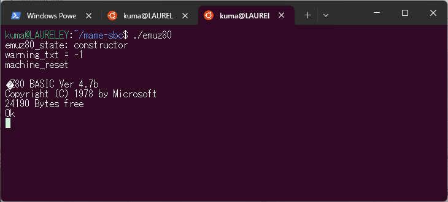

# mame-sbc ... A shrunk mame-package for SBC/RetroCPU developers

> * [Japanese README is here](README_ja.md)
> * [Install & Run process is here(Sorry, Japanese only)](INSTALL.md)

A trial to build a SBC emulator, with CPU/IO companion processor Single Board Computer(SBC).  There are two key items, CPU, and a serial interface for SBC console.  No video/audio devices are needed, therefore omitted.  Floppy software emulator on SD card are appreciated, so far not yet be ready.

Now I am trying to prepare a shrunk mame package with various CPU and some.

So far I have prepared four examples of SBC emulations, `emuz80`, `sbc8080`, `sbc6800`, and `sbc6809`, made by `@vintagechips` (Den'noh-Densetsu). All of them are famous among RetroCPU guys.

Two of the four emulators, `sbc6800` and `sbc6809` are developed by @ryu10, and he kindly approved to be merged to my repository, thanks.

> emuz80: [an article](https://vintagechips.wordpress.com/2022/03/05/emuz80_reference/) and its related [data repository](https://github.com/vintagechips/emuz80)  
> sbc8080: [an article](https://vintagechips.wordpress.com/2018/06/24/sbc8080-cpu%E3%83%AB%E3%83%BC%E3%82%BA%E3%82%AD%E3%83%83%E3%83%88/), [document PDF](http://www.amy.hi-ho.ne.jp/officetetsu/storage/sbc8080_techdata.pdf), and [a datapack](http://www.amy.hi-ho.ne.jp/officetetsu/storage/sbc8080_datapack.zip)  
> sbc6800: [an article](https://vintagechips.wordpress.com/2017/12/05/sbc6800%E3%83%AB%E3%83%BC%E3%82%BA%E3%82%AD%E3%83%83%E3%83%88/), [document PDF](http://www.amy.hi-ho.ne.jp/officetetsu/storage/sbc6800_techdata.pdf), and [a datapack](http://www.amy.hi-ho.ne.jp/officetetsu/storage/sbc6800_datapack.zip).  
> sbc6809: [an article](https://vintagechips.wordpress.com/2017/12/05/sbc6809%E3%83%AB%E3%83%BC%E3%82%BA%E3%82%AD%E3%83%83%E3%83%88/), [document PDF](http://www.amy.hi-ho.ne.jp/officetetsu/storage/sbc6809_techdata.pdf), and [a datapack](http://www.amy.hi-ho.ne.jp/officetetsu/storage/sbc6809_datapack.zip).  

# Original

The **mame** package resides on https://github.com/mamedev/mame .  They say;

> MAME is a multi-purpose emulation framework.
> 
> MAME's purpose is to preserve decades of software history. As electronic technology continues to rush forward, MAME prevents this important "vintage" software from being lost and forgotten. This is achieved by documenting the hardware and how it functions. The source code to MAME serves as this documentation. The fact that the software is usable serves primarily to validate the accuracy of the documentation (how else can you prove that you have recreated the hardware faithfully?). Over time, MAME (originally stood for Multiple Arcade Machine Emulator) absorbed the sister-project MESS (Multi Emulator Super System), so MAME now documents a wide variety of (mostly vintage) computers, video game consoles and calculators, in addition to the arcade video games that were its initial focus.

I much appreciate it supports numerous types of CPU's, and their complehensive framework.
